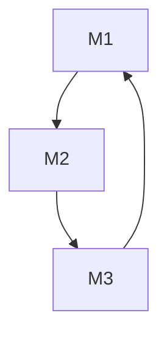
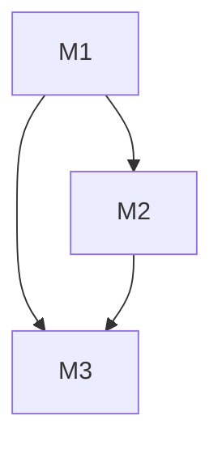

# Program structure
* Name of the file
* Global variables
* Modules with local variables
* Main function with local variables

Modular graphs: High level graph depicting the interdependencies between various modules. This is what forms that program structure.
(M1) f1.c -compiled-> f1.o
(M2) f2.c -compiled-> f2.0
(M3) f3.c -compiled-> f3.0

## In terms of how modules can be developed and tested

Not so good Modular dependencies (Cyclic dependencies)

Okay (Non-cyclic)

## In terms of Global and local variables
variables should be localized unless required.

Good structure module design and good cohesiveness and good coupling leads to good program design.