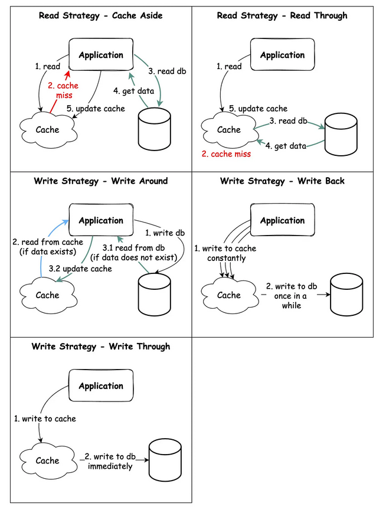

# Caching

## What are the top caching strategies?

Read data from the system:
🔹 **Cache aside**: Application reads from Cache. If cache miss happen, it reads from DB and updates the cache.
🔹 **Read through**: Application reads from Cache. If cache miss happen, the data is fetched from DB and updated in cache directly, and then serviced to the caller. 

Write data to the system:
🔹 **Write around**: data is written in DB only; I/O completion is confirmed when data is written in DB
🔹 **Write back**: data is written in cache first; When data is written in cache, I/O completion is confirmed; data is written to DB asynchronously (background job) and does not block the request from being processed
🔹 **Write through**: Data is written in cache & DB; I/O completion is confirmed only when data is written in both places

## What are the various cache eviction strategies?

| Strategy                    | Eviction policy                       | Use case                                                 |
|-----------------------------|---------------------------------------|----------------------------------------------------------|
| First-In/First-Out (FIFO)   | Evicts the oldest of the entries      | Newer entries are most likely to be reused               |
| Last-In/First-Out (LIFO)    | Evicts the latest of the entries      | Older entries are most likely to be reused               |
| Least Recently Used (LRU)   | Evicts the least recently used entry  | Recently used entries are most likely to be reused       |
| Most Recently Used (MRU)    | Evicts the most recently used entry   | Least recently used entries are most likely to be reused |
| Least Frequently Used (LFU) | Evicts the least often accessed entry | Entries with a lot of hits are more likely to be reused  |

https://en.wikipedia.org/wiki/Distributed_cache
https://en.wikipedia.org/wiki/Cache-oblivious_algorithm
https://en.wikipedia.org/wiki/Cache_stampede
https://en.wikipedia.org/wiki/Cache_language_model
https://en.wikipedia.org/wiki/Cache_coherence
https://en.wikipedia.org/wiki/Cache_replacement_policies
https://en.wikipedia.org/wiki/Locality_of_reference