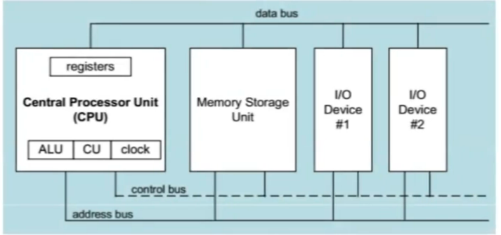
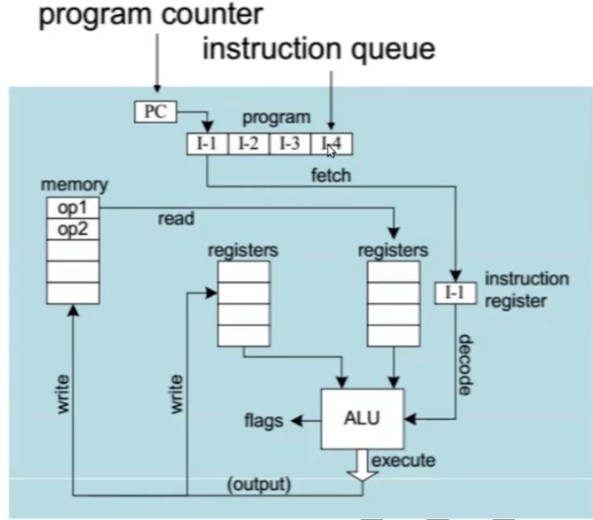
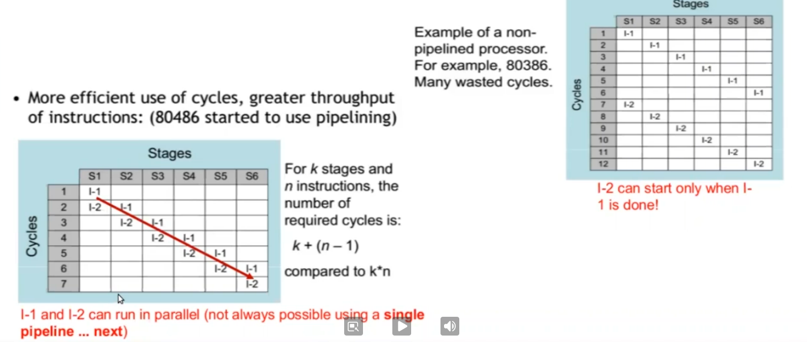
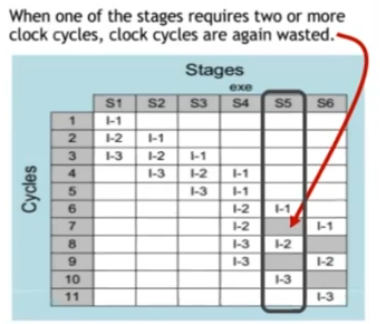
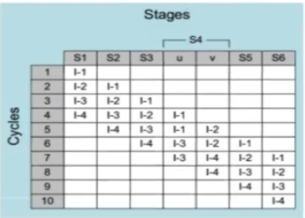

# CPU Refresher

* A microcomputer has a CPU, Memory, I/O devices and buses (memory, data and address)
* The clock synchronizes all CPU operations
* Control Unit (CU) coordinates the sequence of execution steps
* ALU perform the arithmetic and logic operations
* Memory storage holds the application code and data the program uses
* Buses transfer data, address information and control signals.
  * Control Bus carries control signals around the CPU and memory when ops is read or a write.
  * Address Bus: Carries memory addresses for memory locations to be read or written to. It is unidirectional - CPU to memory
  * Data Bus: Carries data for memory locations to be read or written to. It is bi-directional - CPU to memory and viceversa.



## Registers

Registers are memory location with specific purpose.

* Accumulators: Store the results of calculations made by ALU temporarily.
* Program Counters (PC): Keep track of the memory location for the next instruction to be dealt with. PC passes the next address to MAR (memory address register), which points to RAM location.
* Memory Address Register (MAR): Stores the memory location for data or instructions that need to be fetched from memory or stored into memory (RAM).
* Memory Data Register (MDR): Stores the data or instructions that need to be fetched from memory or stored into memory (RAM).
* Current Instruction Register (CIR): Stores the most recently fetched instruction while waiting to be decoded and executed.

Registers holds 64-bit of data/address or 32-bit of data/address, depending on CPU architecture.

## The Clock

The clock is a tiny quartz crystal inside the CPU that 'ticks' at a steady speed. CPU can do something when the clock ticks. In between each tick, it does _nothing_. Curing each tick, it processes a single instruction.

* synchronizes all CPU and BUS operations
* machine (clock) cycle measures time of a single operation
* clock is used to trigger events
* Basic unit of time, 1 GHz -> clock cycle = 1 ns (1 billion cycles in a second)
* An instruction could take multiple cycles to complete, e.g. multiply in 8088 processor takes 50cycles.

## Cache


## CPU's job

CPU as you can now imagine, is made up of billions of transitors that combine to build logic gates to process data and instructions. Transistor is an electronic switch; can be turned on or off by electricity. A bunch of transistors arranged in a special pattern, so they "remember" their on/off state; a single Flip-flop (electronics) stores a single bit, and a bunch of them next to each other form a register (when people say a CPU is 32-bit or 64-bit, this is what they're referring to - the width of the registers). Based on these, we can create specific or general purpose registor - you read about this [here](#registers).



On high level, each instruction is a combination of -

* Fetch
* Decode
* Fetch operands
* Execute
* Store output

If you note, that is a sequential execution of instructions. We needed more speed and hence did not want to lose any cpu cycle.

The concept of pipeline was introduced in 80486 processor - pipelining makes it possible for processor to execute instructions in parallel. Instruction execution is divided into discrete stages.


For k stages and n instructions, the number of required cycle is: ```k + (n-1)``` in pipelined process as against ``k*n``. However, a complex step cannot be subdivided conveniently. An operation takes variation amount of time to execute e.g. operand fetch time depends on where the operands are located - registers, cache or memory. Complexity of operation depends on the type of operation e.g. add may take one cycle while multiply may take several cycles.



That's where super-scalar processor came into being. It has multiple execution pipelines. In the following, note that Stage S4 has left and right pipelines (u and v).



For k states and n instructions, the number of required cycles is: `k + n`. Pentium had 2 pipelines while pentium pro had 3 pipelines.

## Hyper-threading

Hyper-threading (officially called Hyper-Threading Technology or HT Technology and abbreviated as HTT or HT) is Intel's proprietary simultaneous multithreading (SMT) (a technique for improving the overall efficiency of superscalar CPUs with hardware multithreading. SMT permits multiple independent threads of execution to better use the resources provided by modern processor) implementation used to improve parallelization of computations (doing multiple tasks at once) performed on x86 microprocessors. It was introduced on Xeon server processors in February 2002 and on Pentium 4 desktop processors in November 2002. Since then, Intel has included this technology in Itanium, Atom, and Core 'i' Series CPUs, among others.

For each processor core that is physically present, the operating system addresses two virtual (logical) cores and shares the workload between them when possible. The main function of hyper-threading is to increase the number of independent instructions in the pipeline; it takes advantage of superscalar architecture, in which multiple instructions operate on separate data in parallel. With HTT, one physical core appears as two processors to the operating system, allowing concurrent scheduling of two processes per core. In addition, two or more processes can use the same resources: If resources for one process are not available, then another process can continue if its resources are available.

In addition to requiring simultaneous multithreading support in the operating system, hyper-threading can be properly utilized only with an operating system specifically optimized for it.

Now, this is what is called vCPU. `Number of vCPUs = Core count * Threads per core`
