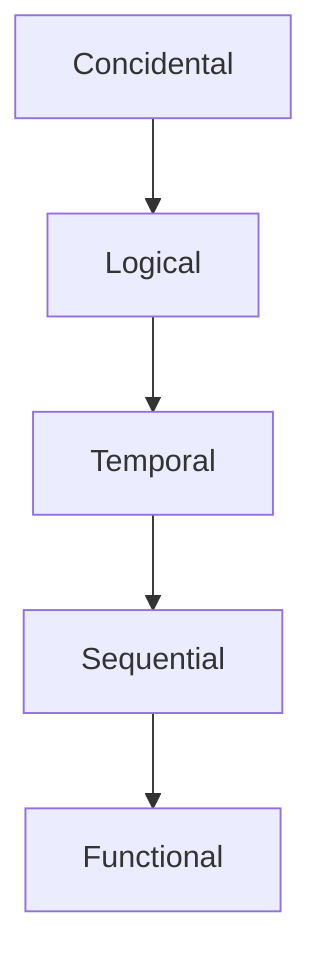

# Cohesion and Coupling

We need good cohesive code with desired coupling.

## Cohesion 
A module should have only related function within
* Functional Cohesion: One specific task by a function
* Sequential Cohesion: A function does multiple things - one after the other. It should be using the shared data.
* Temporal Cohesion: A function is doing multiple tasks since all the task happens at the same time. Good example is ```initialization()``` which requires initializing multiple things simultaneously.
* Logical Cohesion: A functional may do multiple tasks depending on some condition.
* Coincidental Cohesion: A function is doing several disparate things. E.g. We may want to group several utilities together in a group utility function.

Unacceptable to Most Desirable (Logical is also undesirable, Temporal is okay)


## Coupling
If a module uses a function of another module, then coupling arises. Modules should be well coupled with each other. 

* Content: One module refers to other's local data or branches. This is the worst form of coupling and breaks multiple design principles. Co-routines is example.
* Common: Modules can access global variables and modify them. This leads to unknown dependencies outside direct interactions.
* Control: One module can provide some condition in another module which alters its controls structure.
* Stamp: Passing whole object when only specific elements are needed. It does have unnecessary object passing and both dependent modules need structure knowledge.
* Data: Communication is through a parameter list. Minimal information shared.

Data and Stamp are okay - they have less interdependency, coordination and information flow. However, these increases as we move from Control to Common to Content and hence  are undesired.

## Learning
Based on above learning, we can conclude that a good program structure design should have -

* Hierarchical Modular structure
* Tight Cohesion within a module
* Loose coupling between modules.

