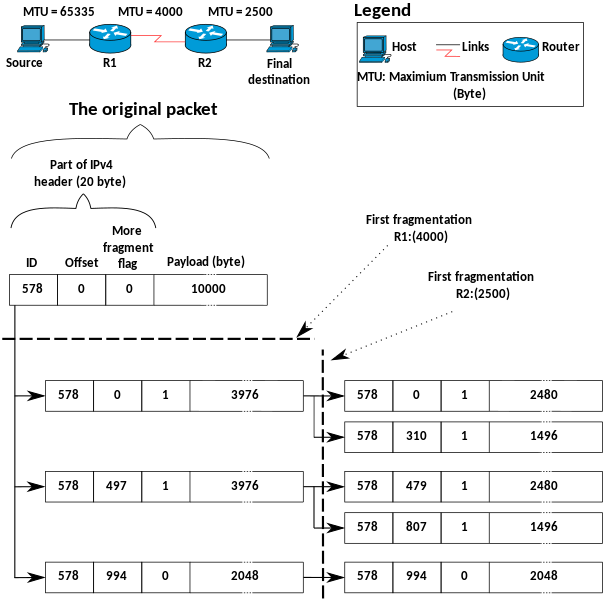
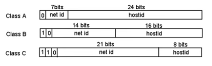
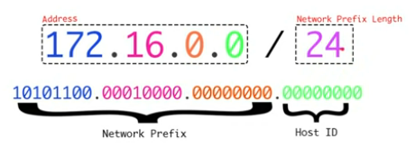

# Deep dive to IP

* The core protocol of the TCP/IP suite and the main protocol of the Network (internetwork) layer
* Main purpose is to provide internetwork datagram delivery services to layer 4 protocols like TCP and UDP
* Often uses layer 3 devices like routers, multilayer switches, load balancers, and firewall appliances to forward datagrams (packets)

## Characteristics of IP

* Universal addressing
    * Defines addressing mechanism, called Universal Address Resolution Protocol (ARP) with IP version 4 and 6 addressing schemes, which maps physical burned in address (BIA) to logical IPv4 or IPv6 address.
    * This continues to work when you are roaming - while BIA remains the same, IP continues to change.
* Protocol independence 
  * Works with both the Ethernet, 802.11 wireless family, DOCSIS, etc.
* Connectionless delivery 
  * No handshake setup before transmission to remote host
  * It cannot set up IP to IP connections - it used TCP / UDP
* Unreliable and unacknowledged delivery
  * No tracking of datagrams
  * There is no native security

## Main IP protocol functions

* Encapsulation and labeling of data from the upper application layers
* Formatting and identification
* Fragmentation and reassembly - This is one of the key activity, to ensure that the entire datagram or frames or packet is received by the target over network with varying maximum transmission unit (MTU). Please see the pic below.
* Routing and Internet delivery 
  * Help comes from ICMP and dynamic routing protocols like RIP, OSPF, and BGP to name a few

[Image Source](https://commons.wikimedia.org/wiki/File:IPv4_Fragmentation_example_-en.svg)

## Main IP Protocol

* The functions of IP were planned and designed well before the protocol suite was defined
* The original Transmission Control Program was eventually divided into Transmission Control Protocol (TCP) and Internet Protocol (IP)
* There were three previous versions of the original TCP; so when the split occurred, IP was called version 4 
* **There were never a usable IP versions 1, 2 or 3!**
* Version 5 relates to an experimental TCP/IP protocol called the Internet Stream Protocol, Version 2, originally defined in RFC 1190 
* Version 5 doesn't technically exist, as it was intentionally skipped to avoid or rectify confusion 
* This protocol never progressed, so it was bypassed in favor of IP version 6

Lets deep dive into addressing concept, which is one of the biggest things for Internet Protocol.

## Addressing Concepts

* When representing hosts on an internetwork, it is critical that coordinated, non-duplicate addresses are being used 
* Every device on the network will have at least one IP address 
* For most end-users, the addressing is typically shielded by the Domain Naming System (DNS), so friendly names are all that are referenced in practice. For example, www.oreilly.com maps to 184.27.190.97
* Groups of assigned (allocated) IP addresses are assigned to users and organizations
* Various service providers (ISPs, ITSPs, and CSPs) typically provide addresses and routing services on the Internet 
* The most common is the dotted-quad or dotted-decimal IPv4 address

## IPv4

IPv4 as you see 172.16.0.0, is a 32 bit value, similar to 10101100.00010000.00000000.00000000 (each string separate by . is called Octet). Based on this, there are 2^32 total address possibilities = 4,294,967,296

When originally defined, 
* every address had a network portion and a host portion and was grouped into one of the five classes (A, B, C, D, E) - This is classful networks. This had consequence, which we will see in [Classful Network](#classful-networking)
* Most of the space is unicast (also multicast and broadcast)
* Public and Private (RFC 1918) addresses

## Classful Networking

* Class A - 8 bits are used and 24 bits are left for the hostId. This is what is known /8 block which will discuss further. This leaves 2^24 IPs to be used.
* Class B - 16 bits are left for the hostId. 65,536 (2^16) IP addresses
* Class C - 8 bits are left for the hostId. 256 (2^8) IP addresses

This typically led to wasting a lot of unused IP addresses and was diluting the IPv4 address space much quicker than required. This is the time when IPv6 was introduced which can handle 3.4 * 10^38 address, but struggled to get people to migrate over to IPv6 since a lot of software and hardware were designed around IPv4. IPv6 was conceptualized and implemented in 1998 and not everything has moved to IPv6 in 2022.

### NAT
Came as somewhat of a solution to the problem.
* They allow packet re-routing to private IPs
* Slows the IPv4 exhaustion problem

NAT, Network Address Translation. It sits at the edge of Internet, referred to as NAT gateway. So, any network behind the NAT are invisible to the Internet.

### CIDR
CIDR, Classless Inter-Domain Routing. It  simplifies routing tables and reduces IPv4 exhaustion.
Private IP Address Space, as defined by IANA, Internet Assigned Numbers Authority

| From        | To              |
|-------------|-----------------|
| 10.0.0.0    | 10.255.255.255  |
| 172.16.0.0  | 172.31.255.255  |
| 192.168.0.0 | 192.168.255.255 |

CIDR is defined by its network prefix and host id and depicted a address and network prefix length.

So, if you declare CIDR block as 10.0.0.0/20, it means you network is 20 bit long, and you have an option to create 2^12, 4096 assignable IP addresses.

#### Calculating CIDR Starting and Ending Range
Let's assume, CIDR block is 10.0.0.0/20. It means first 20 has been used up by network. So, 11111111.11111111.11110000.00000000 is used up. For us to use, now is - 00000000.00000000.00001111.11111111, which is now translating into 0.0.15.255. Overlaying now with starting range of 10.0.0.0, we get to 10.0.15.255.

## IPv6

## Further reading

* [Wikipedia - Internet Protocol](https://en.wikipedia.org/wiki/Internet_Protocol)