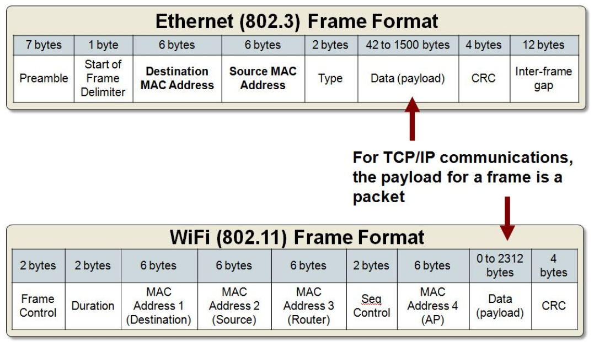

# TCP/IP Model
The initial TCP has proposed to have at least two layer. ISO (International Organisation of Standards) proposed a more generic multilayer model to support network communication, which is now referred to as [OSI](#osi-model). This then upgraded to latest 4 layered [TCP/IP model](tcp-ip-model.md)

## OSI Model

Open System Interconnection Model

https://www.youtube.com/watch?v=vv4y_uOneC0

| Number | Name                       | Description                                                                   | Example                                            |
|--------|----------------------------|-------------------------------------------------------------------------------|----------------------------------------------------|
| 7      | Application                | To accomplish a networked user task                                           | HTTP, FTP, SMTP, DNS, TELNET                       |
| 6      | Presentation               | Expressing and translating data formats                                       | ACII, PNG, MPEG, AVI, MIDI                         |
| 5      | Session                    | To accommodate multiple session connections                                   | SSL/TLS, SQL, RPC, NFS                             |
| 4      | Transport                  | Connecting multiple programs on the same system                               | TCP, UDP, SPX, AppleTalk                           |
| 3      | Network (or Internet work) | Facilitate multihop communications across potentially different link networks | IP, IPX, ICMP, ARP, BGP, OSPF                      |
| 2      | Link                       | Communication across a single link including media access control             | PPP/SLIP, Ethernet, Frame Relay, ATM               |
| 1      | Physical                   | Specifies connectors, data rates, and encoding bits                           | Binary Transmission, encoding, bit rates, voltages |

## TCP / IP model

This new TCP/IP model was proposed by Microsoft.

<table>
<th>Number</th>
<th>Name</th>
<th>TCP/IP</th>
<tr><td>7</td><td>Application</td><td rowspan="3">Application</td></tr>
<tr><td>6</td><td>Presentation</td></tr>
<tr><td>5</td><td>Session</td></tr>
<tr><td>4</td><td>Transport</td><td>Transport (host-to-host) UDP</td></tr>
<tr><td>3</td><td>Network (or Internetwork)</td><td>Network (or Internetwork)</td></tr>
<tr><td>2</td><td>Link</td><td rowspan="2">Network Access (DOCSIS)</td></tr>
<tr><td>1</td><td>Physical</td></tr>
</table>

It is important to under this layer 2 or the Network Access Layer. This is what needs the most protection.

## Network Access Layer (Layer 2)

* Sends and receives IP datagrams for the IP service
* It also carries other support protocols like ARP for IPv4
* TCP/IP supports many Link Layer protocols
  * Ethernet wired LANs
  * 802.11 wireless LANs
  * Cable (DOCSIS) and DSL variants
  * Cellular technologies like WiMAX
  * Satellite technologies
* Point-to-Point Protocol (PPP) and its many variants helped TCP/IP run over many different layer 2 implementations
* The most common Link layer protocol data unit (PDU) is called a "frame"
* They are often variable lengths where the upper bound is called the Maximum Transmission Unit (MTU) and is measured in Kilobytes.
* The behavior is governed my many IEEE 802 LAN/MAN standards:
  * 802.3, 802.1w, 802.3ae, 802.3bm-2015
  * 802.11g/n/ac, 802.11ax, 802.15.1
  * 802.1q and 802.1X

### MAC (Media Access Control)

* The IEEE 802 48-bit address MAC address comes from the original Xerox Ethernet addressing scheme
* It is represented in hex and is most commonly referred to as the EUI-48 identifier for addressing
* A Media Access Control (MAC) address is typically tied to a core connection device in your computer called the network interface card, or NIC
* A NIC converts data into an electrical signal that can be transmitted over the network
* Every commercially viable NIC has a hardware address that's known as a MAC
* Whereas IP addresses are linked with TCP/IP networking software stacks, a MAC address is linked to the hardware of logical or physical network adapters.
* Manufacturers all place a special number sequence (Organizationally Unique Identifier or OUI) that identifies them as the manufacturer
* The OUI is usually at the front of the address. For example, consider "00-14-22-01-23-45." The OUI for the manufacturer of this host is the first three octets—"00-14-22"
* Dell: 00-14-22, Nortel: 00-04-DC, Cisco: 00-40-96, Belkin: 00-30-BD

P-2-P protocol using Upper MAC and LLC (device driver which communicate with ethernet, LAN, etc.). We now are using next generation PPP.