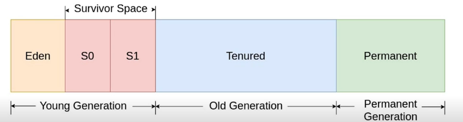

# C++ and Java

| C++                     | Java                         |
|-------------------------|------------------------------|
| C with classes          | Only uses classes            |
| Has portability issues  | Portable programs - uses JVM |
| Fairly good performance | Lesser performance than C++  |

Compiler in C++ converts into C. Even polymorphism using VTABLE and VPTR allows conversion into C. However,
C++ compiler compile in machine code targeted to machine and hence not portable to a different machine architecture. You would need to recompile for target machine.

Java compiler converts the java code into a bytecode which is then deployed on JVM. JVM then interpret this code. JVM itself however is compiled for different machine architecture. But it does allow Java code to be portable as long as JVM can be made available on that machine. This is why it is little slower than C++.

Java provide more abstraction than C++ and hence easier to write programs in Java. 
For example, distributed computing program would be easier to write in Java due to network abstraction that it provides. Similarly, Java provides the thread abstraction where you can write multithreaded program more easily.

The key feature of Java is its JVM. Let's discuss it little more. JVM is a stack based machine as opposed to register based machines which is more native to OS. It is easier to understand the state of the program on stack based models. As discussed, Java compiler compiles the code to bytecode (which is intermediate representation) and these classes are loaded on run time into the JVM. By this mechanism, the classes can be loaded across the network (of course, this does pose security issues and needs to be managed separately). Machine architecture compatible JVM then interprets this bytecode line by line and runs it on the machine. Interpretation is slow. It also generates larger memory footprint. This is precisely a reason why Java does not support multiple inheritance. It does allow interfaces which does not have attributes and hence does not increase memory footprint substantially.

The second most feature of Java is its Just-In-Time(JIT) compilation to improve the overall execution time. It targets frequently executed parts of programs and compiles the bytecode to binary at run-time so that it can be executed directly on machine without interpretation.

The next most feature of Java is its Garbage Collection - this is the memory management module for Java. Garbage collection examines heap memory, identifies referenced and unreferenced objects and releases unreferenced memory. There are many algorithms for garbage collection. 
* **mark-and-sweep** algorithm. The steps involved in this are **marking**, **normal deletion** and **deletion with compaction**. When garbage collection runs, it may hold all the threads impacting the overall execution time.
* **Generational Garbage Collection**. As the object list grows, gc time increases. We categorized objects into short-lived and long-lived objects. So, breakup the heap into generations - Young, Old and Permanent. Object which survives Young is moved into old and object surviving old is moved into permanent. Garbage collection needs to happen frequently on young (most objects are short-lived) and with a decreasing frequency on old and permanent.

**A side effect to consider - program ended and GC did not trigger before that. Finalizer - More research required** 