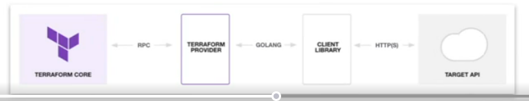

# Terraform
* Built by Harshicorp in 2014. It is written in Go Language.
* It is [infrastructure as code](#infrastructure-as-code-iac) service. It is more descriptive in nature than cloud-formation. It uses a human-readable language known as Harshicorp configuration language (HCL) or JSON
* Automate infrastructure creation - deployment of infrastructure happens with a push-based approach (no agent to be installed on remote machines).
* Maintains state. You can push it in git and maintain state. State changes allows you to track resource changes
* Open source and cloud provider-agnostic - meaning, it supports major cloud platform like AWS, Azure, Google Cloud, Alibaba, etc. Suitable for multi-cloud.
* Installation is on Windows, Linux and Mac OC
* No official Graphical UI
* It runs on machine Terraform server

## How does Terraform work
When we install Terraform, we install the terraform binary. Binary makes API calls to endpoints exposed by cloud providers. It uses its CLI tool for deploying the infrastructure - under the hood, it makes API calls on behalf of a provider including authentication mechanisms. It reads the configuration file as defined by us, which tells which API calls to make with cloud providers, like AWS, GCP and Azure. In terms of cloud provider portability, the features are different, Terraform's technical approach is not. Cloud providers don't support the exact same infrastructure and are named differently. Terrform allows you to use the same approach to define provider-specific configuration. You can use the same Terraform language, toolset, and IaC practices.

## Terraform Components
Key building blocks in architecture
* **Executable**: Binary run from the command line that contains the core functions
* **Configuration file(s)**: files with extension ```.tf``` or ```.tfvars``` that define the desired config for provisioning infra
* **Provider plugins** aka provider: Executables invokes by Terraform to interact with cloud provider APIs, hosted on a registry
* **State data**: the desired configuration and its current state to optimize communication between terraform machine and target environments. Terraform persists state - this means it knows what has been created before and applies changes only. This state is stored in internal databases, each resource is represented by a key-value in the entry (json), usually locally as well. Any changes to the resources will be reflected in the state. Locally, the state is saved in the file terraform.tfstate. Remote state handling exists to support consistent team collaboration and is preferred in a team setting - this needs to configured though. Terraform Cloud or Enterprise provides this out of box. There are many benefits of managing this state -
  * Dependencies: Resources can have dependencies on each other - Terraform retains this metadata to be able to safely perform operation e.g. delete
  * Performance: Terraform stores a cache of the attribute values for all resources in the state for performance reasons
  * Consistency: Terraform employs locking to avoid synchronization and collaboration issues, it used .lock file.

## Installation
Please use standard guideline as provided by Harshicorp.

You can use [tfswitch](https://github.com/warrensbox/terraform-switcher) which lets you manage and use Terraform versions in parallel.


## Basic Terraform commands

Main commands:
init          Prepare your working directory for other commands
validate      Check whether the configuration is valid
plan          Show changes required by the current configuration
apply         Create or update infrastructure
destroy       Destroy previously-created infrastructure

All other commands:
console       Try Terraform expressions at an interactive command prompt
fmt           Reformat your configuration in the standard style
force-unlock  Release a stuck lock on the current workspace
get           Install or upgrade remote Terraform modules
graph         Generate a Graphviz graph of the steps in an operation
import        Associate existing infrastructure with a Terraform resource
login         Obtain and save credentials for a remote host
logout        Remove locally-stored credentials for a remote host
metadata      Metadata related commands
output        Show output values from your root module
providers     Show the providers required for this configuration
refresh       Update the state to match remote systems
show          Show the current state or a saved plan
state         Advanced state management
taint         Mark a resource instance as not fully functional
test          Experimental support for module integration testing
untaint       Remove the 'tainted' state from a resource instance
version       Show the current Terraform version
workspace     Workspace management


| Commands           | Usage                                                          |
|--------------------|----------------------------------------------------------------|
| terraform init     | Downloads any plugins required to run templates                |
| terraform fmt      | will format the file with proper indentation                   |
| terraform validate | will validate the file                                         |
| terraform plan     | will give you a list of resources that will be created/deleted |
| terraform apply    | will create/delete resources                                   |
| terraform destroy  | will delete all the resources created by terraform             |

* Scope: Identify the infrastructure of your project
* Author: Write the configuration for your infrastructure
* Initialize; Install the plugins Terraform needs to manage the infrastructure
* Plan: Preview the changes Terraform will make to match your configuration
* Apply: Make the planned changes
* Destroy: To destroy the infrastructure
* Providers: Providers are a logical 
* Module:  Modules are reusable Terraform configurations that can be called and configured by other configurations. Most modules manage a few closely related resources from a single provider.
* Registry:  The Terraform Registry makes it easy to use any provider or module. To use a provider or module from this registry, just add it to your configuration; when you run `terraform init`, Terraform will automatically download everything it needs.

Examples of learnings:
[Here](https://github.com/abhinavofficial/iitm-cloud-blockchain-iot/tree/main/cloud-devops/Week_3/terraform_exercises)

Terraform Comparison: https://terraform.io/intro/vs/index.html
Terraform Resources: 
Getting Started: https://learn.hashicorp.com/terraform?utm_source=terraform_io

## Infrastructure as Code (IaC)
Very simply, it is to manage infrastructure with the help of code.
* Treats all aspects of operations as software via configuration
* These configurations are managed in one and more files. Code is tracked in SCM repository, for example git
* Post this, you would need some tool to automatically apply those configurations for actual provision. This automation makes the provisioning process consistent, repeatable and updates fast & reliable. 

### Salient feature of IaC
* **Repeatable Processes**: Clear instructions that describe the desired state
  * A set of instructions are defined with the help of declarative language.
  * Operations are idempotent, e.g. an update to the environment will only make necessary changes but not duplicate what already exists
* **Consistent Environments**: Environment should look extremely similar
  * Projects often use a variety of deployment environment, e.g. development, staging, and productions
  * The same automation code can be used to provision infrastructure so that it looks consistent across all environments.
* **Reusable Functionality**: Configuration can be abstracted and applied to a set of projects
  * Configuration is defined with the help of code
  * Code can be shared across different repositories
* **Self-Documenting**: Source code represents the architecture
  * Each piece of infrastructure has been described with a set of instructions (code comment)
  * No more guesswork on what configuration has been used to provision infrastructure.
* **Financial Savings**: Increased efficiency, fewer mistakes through automation
  * Reduced risk due to minimizing human error
  * Infrastructure can be verified with [automated tests](#automated-test) .
  * IaC functions can be used to spin down environments during times of less traffic. Example, decrease the manual grunt work for DevOps personnel and spending it on mission-critical tasks instead. 

## Automated Test
Learning in progress..

## Key Concept for working with Terraform
Terraform configuration is defined by a collection of files (.tf or tf.json). A module defines a set of (potentially versioned) configuration files(s). Root module and child module can be based of directory

### Object Types
#### Providers
Providers are the plugins that Terraform uses to interact with a cloud provider through its API. Every supported service or infrastructure platform has a provider that defines which resources are available and performs API calls to manage those resources.

Each provider adds a set of resource types and/or data sources that Terraform can manage. Every resource type is implemented by a provider; without providers, Terraform can't manage any kind of infrastructure. Most providers configure a specific infrastructure platform (either cloud or self-hosted). Providers can also offer local utilities for tasks like generating random numbers for unique resource names.

#### Resources
Resources are the most important element in the Terraform language. It defines the infrastructure pieces to be created in a target environment. Each resource block describes one or more infrastructure objects, such as virtual networks, compute instances, or higher-level components such as DNS records.
* ```Resource Blocks``` documents the syntax for declaring resources.
* ```Resource Behavior``` explains in more detail how Terraform handles resource declarations when applying a configuration.
* The Meta-Arguments section documents special arguments that can be used with every resource type, including ```depends_on```, ```count```, ```for_each```, ```provider```, and ```lifecycle```.
* ```Provisioners``` documents configuring post-creation actions for a resource using the ```provisioner``` and ```connection``` blocks.
> Since provisioners are non-declarative and potentially unpredictable, it is strongly recommended that you treat them as a last resort.

#### Data Source
Data sources allow Terraform to use information defined outside of Terraform, usually provider by provider, or as defined by another separate Terraform configuration, or modified by functions. Each provider may offer data sources alongside its set of resource types. More on this is present [here](https://www.terraform.io/language/data-sources)

This means we can use pick some value as provided by some via data sources.

```hcl
# Find the latest available AMI that is tagged with Component = web
data "aws_ami" "web" {
  filter {
    name   = "state"
    values = ["available"]
  }

  filter {
    name   = "tag:Component"
    values = ["web"]
  }

  most_recent = true

  owners = ["982938239"] 
}

# The id can then be used here.
resource "aws_instance" "web" {
  ami           = data.aws_ami.web.id
  instance_type = "t1.micro"
}
```

#### Provisioners
You can use provisioners to model specific actions on the local machine or on a remote machine in order to prepare servers or other infrastructure objects for service.

Terraform includes the concept of provisioners as a measure of pragmatism, knowing that there are always certain behaviors that cannot be directly represented in Terraform's declarative model.

However, they also add a considerable amount of complexity and uncertainty to Terraform usage. Firstly, Terraform cannot model the actions of provisioners as part of a plan because they can in principle take any action. Secondly, successful use of provisioners requires coordinating many more details than Terraform usage usually requires: direct network access to your servers, issuing Terraform credentials to log in, making sure that all the necessary external software is installed, etc.

local-exec, remote-exec, connection,

#### Outputs
to capture the output return from terraform.

## Working with Terraform
### Configuration Syntax

HCL is preferred over JSON.

```hcl
BLOCK_TYPE "BLOCK_LABEL" "BLOCK-LABEL-NAME" {
  IDENTIFIER = EXPRESSION
}
# Block Type is a container for defining the configuration of an object delimited by curly braces (can have nested blocks) and is one of the object types, example resource, data, etc.
# Block Label is the specific of that selected object type, example, aws_instance of resource type
# Optional Block Label Name is useful if you want to reference it from somewhere else
# Identifier = Expression, aka argument is one or many key value pair(s), where identifier (key) expresses the property of the block label and value or example can simple (literal) or complex (computed values assigned to an argument) expression to assign to that property.
```

The syntax has some constraints:
* Identifier can contain letters, digits, underscores, and hyphens. The first character of an identifier must not be a digit, to avoid ambiguity with literal numbers
* Comments can be defined by #, //, or /* */
* Configuration files must always be UTF-8 encoded

### Working with provider
HCL is a plugin-based architecture. Core terraform binary is small, providers are developed as plugins and is used for interacting with endpoints with providers.
* Terraform Core: The binary that communicates with plugins to manage infrastructure resources.
* Terraform plugins: Executable binaries written in Go that communicates with Terraform core over an RPC interact.



Provider plugins are available in public [registry](https://registry.terraform.io/browse/providers), a central location for plugins and their documentation. To tell our configuration file about these providers is simple. For example, for using AWS as provider, copy and paste the below code into your Terraform configuration. Then, run terraform init.
```hcl
# Terraform 0.13+
# Until we point it to a private registry, it would refer to public registry.
terraform {
    required_providers {
        aws = { # the free-form name of the provider
            source = "hashicorp/aws" # the location of provider plugin [<hostname>/]<namespace>/<type>
            version = "5.6.2" # version (range) selector for the plugin. If you leave this, this would resolve to the latest version
        }
    }
}

provider "aws" {
    # Configuration options
}

/*
Version Value                   Meaning
no assigned value attribute     Picks latest version of the provider available in registry
>= 1.2.1                        Greater than or equal to the version 1.2.1
<= 1.2.1                        Less than or equal to the version 1.2.1
~> 1.2.1                        Any version in 1.2.x range up to next minor version (1.3.0)
>= 1.2.1, <= 1.5.0              Any version between 1.2.1 and 1.5.0
*/
```

> If you need to read on how to use terraform for any specific resource type, you can read [here](https://registry.terraform.io/providers/hashicorp/aws/latest/docs)

> When we start to build out terraform documents, it is important to understand various details like VPC, Subnet, CIDR, Internet Gateway, Route table, Route table association and Security Group - egress and ingress, some of these concepts are covered under [Software-Design](../../Software-Design). Please read through under network-address section.

When you run a terraform command which requires some functionality within plugin from a provider, it would create a lock file. It lives locally and stores resolved versions + checksum of provider plugins.
* Terraform creates or updates the dependency lock file each time you run the **init** command.
* The dependency lock file is always name ```.terraform.lock.hcl``` and is meant to be checked into version control.
* Use the ```-upgrade``` flag with the ```init``` command to upgrade a provide plugin version or simply change the version number.

All providers publish the API in the registry along with the documentation, including how to use.

Defining a provider is optional, so if we do not define it, terraform will use the prefix of block level to determine provider on Terraform registry and download the latest version available. This is not the best practice though.

#### Configuring Provider(s)
If we are using a provider, say AWS, we also need to define which regin to use. 
```hcl
provider "aws" {
  region = "us-east-2" # Default provider" Any resource that does not assign a provider explicitly will use this region.
}
```
In case you need to use multiple providers, you need to use an alias to reference the same.

```hcl
provider "aws" {
  alias  = "west" #Aliased provider: A resource can refer to this provider explicitly by assigning the provider argument (in this case aws.west)
  region = "us-east-2"
}
```

When we run terraform init,
* Terraform automatically fetches plugin from the registry and stores them (local cache) in the .terraform subdirectory.
* Caching is enabled by default and a plugin version already available in the .terraform subdirectory will be reused.
* Cache directory be configured with the environment variable ```TF_PLUGIN_DIR``` or the CLI option ```--plugin-dir``` - this can be used when sharing this with team, but generally not used

We also need to provide credentials to deploy the infrastructure. It can be done by looking at the provider's exposed attributes for consuming credentials. For example, with aws
```hcl
provider "aws" {
  region = "us-east-2"
  access_key = "my-access-key"
  secret_key = "my-secret-key"
}
```
This is not recommended due to security concern. Alternately,
```hcl
provider "aws" {
  region = "us-east-2"
  shared_credential_files = ["path-to-credentials-file"]
  profile = "profile-name" # Option
}
```

#### Defining Resource(s)

```hcl
# The id can then be used here.
resource "aws_instance" "web_server" {
  ami           = "ami-0c55b1asdfk7jk" # this info can be found 
  instance_type = "t1.micro"
}
```

```hcl
# Find the latest available AMI that is tagged with Component = web
data "aws_ami" "web" {
  filter {
    name   = "state"
    values = ["available"]
  }

  filter {
    name   = "tag:Component"
    values = ["web"]
  }

  most_recent = true

  owners = ["982938239"] 
}

# The id can then be used here.
resource "aws_instance" "web" {
  ami           = data.aws_ami.web.id
  instance_type = "t1.micro"
}
```

### Terraform Core Workflow

Three-step approach on a high level: Write -> Plan -> Apply

* Write:
  * Write configuration files with an IDE or text editor
  * Souce code checked into version control
  * Terraform syntax can be automatically formatted and validated
* Plan:
  * Preview changes without actually perform them
  * Similar to dry run option
* Apply:
  * Apply your updated configuration to the target environment
  * Commit changes to version control

```terraform init```
* Prepare work directory
* Parse config
* Retrieve provider plugins
* Cache in the .terraform directory

```terraform validate```
* Check for syntax errors
* Does not guarantee successful deployment
* Should be done in CI/CD before plan and apply

```terraform plan```
* Determine differences between local state and deployed infra

```terraform apply```
* Deploying the infrastructure or changing its delta

```terraform destroy```
* Delete infrastructure in target environment based on state data
* You can delete one or more resource or full environment.

### Working with input variables, local/output values, and data sources


## Example work
* [TFC getting started]()

## Next steps

* [Terraform](https://www.terraform.io/docs)
* [Terraform and AWS](https://aws.amazon.com/blogs/apn/terraform-beyond-the-basics-with-aws/#:~:text=Terraform%20by%20HashiCorp%2C%20an%20AWS,Web%20Services%20(AWS)%20infrastructure.)
* [Terraform AWS Provider](https://registry.terraform.io/providers/hashicorp/aws/latest/docs)

## Terraform and other tools

### Terraform and Ansible
* **Ansible**: Configuration management tool for installing/configuring software and tools in the infrastructure which already exists.
* **Terraform**: Manages Infrastructure - it may invoke Ansible after infrastructure as been deployed.
* When to involve Ansible?
  * You already have Ansible playbooks you want to invoke
  * Nowadays, it is more common to create an immutable image that already contains the software needed.

### Terraform and Packer
* **Packer**: It is provided by Harshicorp. It creates machine images for multiple platforms.
* **Terraform**: Terraform can use machine image to provision infrastructure.
* When to involve Packer?
    * To shorten deployment time by baking needed functionality into AMI
    * To simplify or avoid logic in Terraform needed for installing additional tooling, monitoring, logging, etc. on top of base AMI.

### Terraform and Consul
Do I need to involve a state backend?
* **Consul**: It is provided by Harshicorp. It can be used to store state data in a backend to improve team collaboration. It is one of the configuration backend supported by Terraform. Effectively, it is a key-value store installed on a dedicated server.
* When to involve Consul?
  * When your team works on Terraform configuration in parallel and runs into potential conflicts a lot.
  * If you do want to buy into Terraform Cloud or Enterprise.