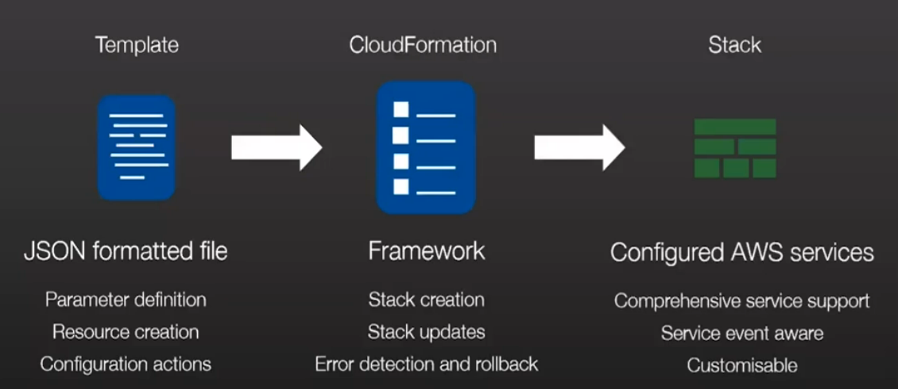

# Cloud Formation

Cloud formation 
Infrastructure as Code
Benefits of IaC

**Infrastructure as Code** is techniques, practices, and tools from software development applied to creating reusable, maintainable, extensible, and testable infrastructure.

## Cloud Formation
**CloudFormation**, a free AWS service is an easy way to create and manage a collection of AWS resources, which allows orderly and predictable provisioning and updating of resources; version control your AWS infrastructure; & deploy and update stacks (the collection of AWS resources) using console, CLI or API. We need to pay the resources that we create.
Most of AWS services are compliant with cloud formation.

AWS CloudFormation is a service that helps you model and set up your AWS resources so that you can spend less time managing those resources and more time focusing on your applications that run in AWS. You create a template that describes all the AWS resources that you want (like Amazon EC2 instances or Amazon RDS DB instances), and CloudFormation takes care of provisioning and configuring those resources for you. You don't need to individually create and configure AWS resources and figure out what's dependent on what; CloudFormation handles that. The following scenarios demonstrate how CloudFormation can help.

Cloud formation is 
* Transparent and Open (JSON and YAML)
* Declarative and Flexible
* Integration Ready
* Customized via parameters

Do not reinvent the wheel
No extra charges

### Components and Technology



Of course, YAML Template is supported as well. It is where we specify the complete description of infrastructure that we need to create. 

High level Template structure :

```json
{
  "Description" : "A text description of the template usage",
  "Parameters" : {
     "A set of inputs used to customize the template per deployment"
  },
  "Resources" : {
    "The set of AWS resources and relationships between them"
  },
  "Outputs": {
    "A set of values to be made visible to the stack creator"
  },
  "AWSTemplateFormatVersion": "2010-09-09"
}
```

It can have
* Parameters
* Mappings: Static table kind of things
* Conditions: Decision based resource creation
* Pseudo-parameter: They pre-exists
* Ref: 
* Resources
* Outputs

## Further Readings
* [AWS CloudFormation](https://docs.aws.amazon.com/AWSCloudFormation/latest/UserGuide/Welcome.html)
* [AWS resource and property types reference](https://docs.aws.amazon.com/AWSCloudFormation/latest/UserGuide/aws-template-resource-type-ref.html)
* [AWS IaC](https://docs.aws.amazon.com/whitepapers/latest/introduction-devops-aws/infrastructure-as-code.html)