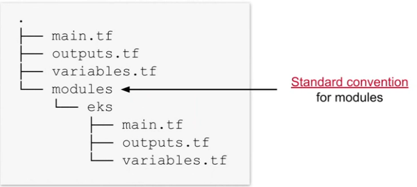

# Terraform

* Built by Harshicorp in 2014. It is written in Go Language.
* It is [infrastructure as code](#infrastructure-as-code-iac) service. It is more descriptive in nature than cloud-formation. It uses a human-readable language known as Harshicorp configuration language (HCL) or JSON
* Automate infrastructure creation - deployment of infrastructure happens with a push-based approach (no agent to be installed on remote machines).
* Maintains state. You can push it in git and maintain state. State changes allows you to track resource changes
* Open source and cloud provider-agnostic - meaning, it supports major cloud platform like AWS, Azure, Google Cloud, Alibaba, etc. Suitable for multi-cloud.
* Installation is on Windows, Linux and Mac OC
* No official Graphical UI
* It runs on machine Terraform server

## How does Terraform work

When we install Terraform, we install the terraform binary. Binary makes API calls to endpoints exposed by cloud providers. It uses its CLI tool for deploying the infrastructure - under the hood, it makes API calls on behalf of a provider including authentication mechanisms. It reads the configuration file as defined by us, which tells which API calls to make with cloud providers, like AWS, GCP and Azure. In terms of cloud provider portability, the features are different, Terraform technical approach is not. Cloud providers don't support the exact same infrastructure and are named differently. Terraform allows you to use the same approach to define provider-specific configuration. You can use the same Terraform language, tool-set, and IaC practices.

## Terraform Components

Key building blocks in architecture

* **Executable**: Binary run from the command line that contains the core functions
* **Configuration file(s)**: files with extension ```.tf``` or ```.tfvars``` that define the desired config for provisioning infra
* **Provider plugins** aka provider: Executables invokes by Terraform to interact with cloud provider APIs, hosted on a registry
* **State data**: the desired configuration and its current state to optimize communication between terraform machine and target environments. Terraform persists state - this means it knows what has been created before and applies changes only. This state is stored in internal databases, each resource is represented by a key-value in the entry (json), usually locally as well. Any changes to the resources will be reflected in the state. Locally, the state is saved in the file terraform.tfstate. Remote state handling exists to support consistent team collaboration and is preferred in a team setting - this needs to configured though. Terraform Cloud or Enterprise provides this out of box. There are many benefits of managing this state -
  * Dependencies: Resources can have dependencies on each other - Terraform retains this metadata to be able to safely perform operation e.g. delete
  * Performance: Terraform stores a cache of the attribute values for all resources in the state for performance reasons
  * Consistency: Terraform employs locking to avoid synchronization and collaboration issues, it used .lock file.

## Installation

Please use standard guideline as provided by Harshicorp.

You can use [tfswitch](https://github.com/warrensbox/terraform-switcher) which lets you manage and use Terraform versions in parallel.

## Basic Terraform commands

Main commands:

| Command  | What does it do                                    |
|----------|----------------------------------------------------|
| init     | Prepare your working directory for other commands  |
| validate | Check whether the configuration is valid           |
| plan     | Show changes required by the current configuration |
| apply    | Create or update infrastructure                    |
| destroy  | Destroy previously-created infrastructure          |

All other commands:

| Command      | What does it do                                             |
|--------------|-------------------------------------------------------------|
| console      | Try Terraform expressions at an interactive command prompt  |
| fmt          | Reformat your configuration in the standard style           |
| force-unlock | Release a stuck lock on the current workspace               |
| get          | Install or upgrade remote Terraform modules                 |
| graph        | Generate a Graphviz graph of the steps in an operation      |
| import       | Associate existing infrastructure with a Terraform resource |
| login        | Obtain and save credentials for a remote host               |
| logout       | Remove locally-stored credentials for a remote host         |
| metadata     | Metadata related commands                                   |
| output       | Show output values from your root module                    |
| providers    | Show the providers required for this configuration          |
| refresh      | Update the state to match remote systems                    |
| show         | Show the current state or a saved plan                      |
| state        | Advanced state management                                   |
| taint        | Mark a resource instance as not fully functional            |
| test         | Experimental support for module integration testing         |
| untaint      | Remove the 'tainted' state from a resource instance         |
| version      | Show the current Terraform version                          |
| workspace    | Workspace management                                        |

| Commands           | Usage                                                          |
|--------------------|----------------------------------------------------------------|
| terraform init     | Downloads any plugins required to run templates                |
| terraform fmt      | will format the file with proper indentation                   |
| terraform validate | will validate the file                                         |
| terraform plan     | will give you a list of resources that will be created/deleted |
| terraform apply    | will create/delete resources                                   |
| terraform destroy  | will delete all the resources created by terraform             |

* Scope: Identify the infrastructure of your project
* Author: Write the configuration for your infrastructure
* Initialize; Install the plugins Terraform needs to manage the infrastructure
* Plan: Preview the changes Terraform will make to match your configuration
* Apply: Make the planned changes
* Destroy: To destroy the infrastructure
* Providers: Providers are a logical
* Module:  Modules are reusable Terraform configurations that can be called and configured by other configurations. Most modules manage a few closely related resources from a single provider.
* Registry:  The Terraform Registry makes it easy to use any provider or module. To use a provider or module from this registry, just add it to your configuration; when you run `terraform init`, Terraform will automatically download everything it needs.

Examples of learnings:

* [Here](https://github.com/abhinavofficial/iitm-cloud-blockchain-iot/tree/main/cloud-devops/Week_3/terraform_exercises)
* [Terraform Comparison](https://terraform.io/intro/vs/index.html)
* Terraform Resources:
* [Getting Started](https://learn.hashicorp.com/terraform?utm_source=terraform_io)

## Infrastructure as Code (IaC)

Very simply, it is to manage infrastructure with the help of code.

* Treats all aspects of operations as software via configuration
* These configurations are managed in one and more files. Code is tracked in SCM repository, for example git
* Post this, you would need some tool to automatically apply those configurations for actual provision. This automation makes the provisioning process consistent, repeatable and updates fast & reliable.

### Salient feature of IaC

* **Repeatable Processes**: Clear instructions that describe the desired state
  * A set of instructions are defined with the help of declarative language.
  * Operations are idempotent, e.g. an update to the environment will only make necessary changes but not duplicate what already exists
* **Consistent Environments**: Environment should look extremely similar
  * Projects often use a variety of deployment environment, e.g. development, staging, and productions
  * The same automation code can be used to provision infrastructure so that it looks consistent across all environments.
* **Reusable Functionality**: Configuration can be abstracted and applied to a set of projects
  * Configuration is defined with the help of code
  * Code can be shared across different repositories
* **Self-Documenting**: Source code represents the architecture
  * Each piece of infrastructure has been described with a set of instructions (code comment)
  * No more guesswork on what configuration has been used to provision infrastructure.
* **Financial Savings**: Increased efficiency, fewer mistakes through automation
  * Reduced risk due to minimizing human error
  * Infrastructure can be verified with [automated tests](#automated-test) .
  * IaC functions can be used to spin down environments during times of less traffic. Example, decrease the manual grunt work for DevOps personnel and spending it on mission-critical tasks instead.

## Automated Test

Learning in progress..

## Key Concept for working with Terraform

Terraform configuration is defined by a collection of files (.tf or tf.json). A module defines a set of (potentially versioned) configuration files(s). Root module and child module can be based of directory

### Object Types

#### Providers

Providers are the plugins that Terraform uses to interact with a cloud provider through its API. Every supported service or infrastructure platform has a provider that defines which resources are available and performs API calls to manage those resources.

Each provider adds a set of resource types and/or data sources that Terraform can manage. Every resource type is implemented by a provider; without providers, Terraform can't manage any kind of infrastructure. Most providers configure a specific infrastructure platform (either cloud or self-hosted). Providers can also offer local utilities for tasks like generating random numbers for unique resource names.

#### Resources

Resources are the most important element in the Terraform language. It defines the infrastructure pieces to be created in a target environment. Each resource block describes one or more infrastructure objects, such as virtual networks, compute instances, or higher-level components such as DNS records.

* ```Resource Blocks``` documents the syntax for declaring resources.
* ```Resource Behavior``` explains in more detail how Terraform handles resource declarations when applying a configuration.
* The Meta-Arguments section documents special arguments that can be used with every resource type, including ```depends_on```, ```count```, ```for_each```, ```provider```, and ```lifecycle```.
* ```Provisioners``` documents configuring post-creation actions for a resource using the ```provisioner``` and ```connection``` blocks.

> Since provisioners are non-declarative and potentially unpredictable, it is strongly recommended that you treat them as a last resort.

#### Data Source

Data sources allow Terraform to use information defined outside of Terraform, usually provider by provider, or as defined by another separate Terraform configuration, or modified by functions. Each provider may offer data sources alongside its set of resource types. More on this is present [here](https://www.terraform.io/language/data-sources)

This means we can use pick some value as provided by some via data sources.

```hcl
# Find the latest available AMI that is tagged with Component = web
data "aws_ami" "web" {
  filter {
    name   = "state"
    values = ["available"]
  }

  filter {
    name   = "tag:Component"
    values = ["web"]
  }

  most_recent = true

  owners = ["982938239"] 
}

# The id can then be used here.
resource "aws_instance" "web" {
  ami           = data.aws_ami.web.id
  instance_type = "t1.micro"
}
```

#### Provisioners

You can use provisioners to model specific actions on the local machine or on a remote machine in order to prepare servers or other infrastructure objects for service.

Terraform includes the concept of provisioners as a measure of pragmatism, knowing that there are always certain behaviors that cannot be directly represented in Terraform declarative model.

However, they also add a considerable amount of complexity and uncertainty to Terraform usage. Firstly, Terraform cannot model the actions of provisioners as part of a plan because they can in principle take any action. Secondly, successful use of provisioners requires coordinating many more details than Terraform usage usually requires: direct network access to your servers, issuing Terraform credentials to log in, making sure that all the necessary external software is installed, etc.

local-exec, remote-exec, connection,

#### Outputs

to capture the output return from terraform.

## Working with Terraform

### Configuration Syntax

HCL is preferred over JSON.

```hcl
BLOCK_TYPE "BLOCK_LABEL" "BLOCK-LABEL-NAME" {
  IDENTIFIER = EXPRESSION
}
# Block Type is a container for defining the configuration of an object delimited by curly braces (can have nested blocks) and is one of the object types, example resource, data, etc.
# Block Label is the specific of that selected object type, example, aws_instance of resource type
# Optional Block Label Name is useful if you want to reference it from somewhere else
# Identifier = Expression, aka argument is one or many key value pair(s), where identifier (key) expresses the property of the block label and value or example can simple (literal) or complex (computed values assigned to an argument) expression to assign to that property.
```

The syntax has some constraints:

* Identifier can contain letters, digits, underscores, and hyphens. The first character of an identifier must not be a digit, to avoid ambiguity with literal numbers
* Comments can be defined by #, //, or /*..*/
* Configuration files must always be UTF-8 encoded

### Working with provider

HCL is a plugin-based architecture. Core terraform binary is small, providers are developed as plugins and is used for interacting with endpoints with providers.

* Terraform Core: The binary that communicates with plugins to manage infrastructure resources.
* Terraform plugins: Executable binaries written in Go that communicates with Terraform core over an RPC interact.


Provider plugins are available in public [registry](https://registry.terraform.io/browse/providers), a central location for plugins and their documentation. To tell our configuration file about these providers is simple. For example, for using AWS as provider, copy and paste the below code into your Terraform configuration. Then, run terraform init.

```hcl
# Terraform 0.13+
# Until we point it to a private registry, it would refer to public registry.
terraform {
    required_providers {
        aws = { # the free-form name of the provider
            source = "hashicorp/aws" # the location of provider plugin [<hostname>/]<namespace>/<type>
            version = "5.6.2" # version (range) selector for the plugin. If you leave this, this would resolve to the latest version
        }
    }
}

provider "aws" {
    # Configuration options
}

/*
Version Value                   Meaning
no assigned value attribute     Picks latest version of the provider available in registry
>= 1.2.1                        Greater than or equal to the version 1.2.1
<= 1.2.1                        Less than or equal to the version 1.2.1
~> 1.2.1                        Any version in 1.2.x range up to next minor version (1.3.0)
>= 1.2.1, <= 1.5.0              Any version between 1.2.1 and 1.5.0
*/
```

> If you need to read on how to use terraform for any specific resource type, you can read [here](https://registry.terraform.io/providers/hashicorp/aws/latest/docs)
> When we start to build out terraform documents, it is important to understand various details like VPC, Subnet, CIDR, Internet Gateway, Route table, Route table association and Security Group - egress and ingress, some of these concepts are covered under [Software-Design](../../Software-Design). Please read through under network-address section.

When you run a terraform command which requires some functionality within plugin from a provider, it would create a lock file. It lives locally and stores resolved versions + checksum of provider plugins.

* Terraform creates or updates the dependency lock file each time you run the **init** command.
* The dependency lock file is always name ```.terraform.lock.hcl``` and is meant to be checked into version control.
* Use the ```-upgrade``` flag with the ```init``` command to upgrade a provide plugin version or simply change the version number.

All providers publish the API in the registry along with the documentation, including how to use.

Defining a provider is optional, so if we do not define it, terraform will use the prefix of block level to determine provider on Terraform registry and download the latest version available. This is not the best practice though.

#### Configuring Provider(s)

If we are using a provider, say AWS, we also need to define which regin to use.

```hcl
provider "aws" {
  region = "us-east-2" # Default provider" Any resource that does not assign a provider explicitly will use this region.
}
```

In case you need to use multiple providers, you need to use an alias to reference the same.

```hcl
provider "aws" {
  alias  = "west" #Aliased provider: A resource can refer to this provider explicitly by assigning the provider argument (in this case aws.west)
  region = "us-east-2"
}
```

When we run terraform init,

* Terraform automatically fetches plugin from the registry and stores them (local cache) in the .terraform subdirectory.
* Caching is enabled by default and a plugin version already available in the .terraform subdirectory will be reused.
* Cache directory be configured with the environment variable ```TF_PLUGIN_DIR``` or the CLI option ```--plugin-dir``` - this can be used when sharing this with team, but generally not used

We also need to provide credentials to deploy the infrastructure. It can be done by looking at the provider's exposed attributes for consuming credentials. For example, with aws

```hcl
provider "aws" {
  region = "us-east-2"
  access_key = "my-access-key"
  secret_key = "my-secret-key"
}
```

This is not recommended due to security concern. Alternately,

```hcl
provider "aws" {
  region = "us-east-2"
  shared_credential_files = ["path-to-credentials-file"]
  profile = "profile-name" # Option
}
```

#### Defining Resource(s)

```hcl
# The id can then be used here.
resource "aws_instance" "web_server" {
  ami           = "ami-0c55b1asdfk7jk" # this info can be found 
  instance_type = "t1.micro"
}
```

```hcl
# Find the latest available AMI that is tagged with Component = web
data "aws_ami" "web" {
  filter {
    name   = "state"
    values = ["available"]
  }

  filter {
    name   = "tag:Component"
    values = ["web"]
  }

  most_recent = true

  owners = ["982938239"] 
}

# The id can then be used here.
resource "aws_instance" "web" {
  ami           = data.aws_ami.web.id
  instance_type = "t1.micro"
}
```

### Terraform Core Workflow

Three-step approach on a high level: Write -> Plan -> Apply

* Write:
  * Write configuration files with an IDE or text editor
  * Source code checked into version control
  * Terraform syntax can be automatically formatted and validated
* Plan:
  * Preview changes without actually perform them
  * Similar to dry run option
* Apply:
  * Apply your updated configuration to the target environment
  * Commit changes to version control

```terraform init```

* Prepare work directory
* Parse config
* Retrieve provider plugins
* Cache in the .terraform directory

```terraform validate```

* Check for syntax errors
* Does not guarantee successful deployment
* Should be done in CI/CD before plan and apply

```terraform plan```

* Determine differences between local state and deployed infra

```terraform apply```

* Deploying the infrastructure or changing its delta

```terraform destroy```

* Delete infrastructure in target environment based on state data
* You can delete one or more resource or full environment.

### Working with variables

Before diving into variables, let's understand what data types can be supported in the input variables.

* Primitive: string, number, bool
* Collection or Complex: list / tuple like [a, b], set, map / object like { name="Mabel", age=52 }

Resource addressing: Referencing a variable or resource attribute in a different context can be done as `BLOCK_LABEL.BLOCK-LABEL-NAME.IDENTIFIER`.

* **Defining Named Values**: Concepts of requesting, referencing, and publishing values. **Input variable** is used for passing information to the terraform configuration. **Local variables** are computed values defined in a configuration file. We can assign an input variable to a local value. Finally, we can have an **output values**, which is return values (typically a run-time value generation when change is applied) of a specific resource in the configuration. So, let understand these with typical use cases.

| Named Value     | Use case                                                                                                  |
|-----------------|-----------------------------------------------------------------------------------------------------------|
| Input Variable  | I want to capture values from the CLI when the end user invokes Terraform and use it in my configuration. |
| Local Variable  | I want to create a variable, assign a value, and reuse it in my configuration similar to a constant       |
| Output Variable | I want to render a runtime value in the console output or use it as an input for a resource or module     |

As specified earlier, there can be multiple configuration files. Many of those files follows certain naming conventions. These naming conventions are now not enforced, but can generally be a good practice. Terraform will automatically resolve those files.

#### Input variables

Input variables can be defined in a file called `variables.tf`

| Argument    | Description                                                      |
|-------------|------------------------------------------------------------------|
| default     | Value to be used if not provided                                 |
| type        | Accepted type for values assigned to variable                    |
| description | End user description that explains the purpose and kind of value |
| validation  | Validation rules applied to provided value                       |
| sensitive   | Obfuscate sensitive information in CLI output                    |
| nullable    | Defines if assigned value can be null                            |

```hcl
variable "ami_id" {
  type = string
  description = "The AMI identifier to use for EC2 instance"
}

variable "availability_zone_names" {
  type = list(string)
  default = ["us-west-2"]
}

# to use it "var.name_of_the_input_variable" notation
resource "aws_instance" "example" {
  ami = var.ami_id
  instance_type = var.availability_zone_names[0]
}
```

Now, when you run ```terraform plan```, terraform will expect user input.

```shell
terraform plan
var.ami_id
  The AMI identifier to use for EC2 instance
  
  Enter a value:
```

If you want to override interactive prompt, you can use `-var` option when running the `plan` and `apply` commands. This is used in CI/CD program.

```shell
terraform apply -var="ami_id=ami-0c55bsbbsk940gt0"

terraform apply -var='availability_zone_names=["us-east-1a", "us-west-1c"]'
```

The third option is to pull the input variables from a `.tfvars` file and is a preferred way to operate for large programs.

```shell
terraform apply -var-file="runtime-var.tfvars"

cat runtime-var.tfvars
  ami_id = "ami-0c55bsbbsk940gt0"
  availability_zone_names=["us-east-1a", "us-west-1c"]
```

Finally, there is way to automatically load of variable files, but some standard naming convention will apply, as below -

* Files named exactly `terraform.tfvars` or `terraform.tfvars.json`
* Any files with name ending in `.auto.tfvars` or `.auto.tfvars.json`

If we have to inject secrets into configuration files, please use that as environment variable with `TF_VAR_` prefix. Please do not put them in .tfvars, since input variables will be stored in the state in plain text. To do that,

```shell
export TF_VAR_third_party_pwd=s3cr3t
export TF_VAR_third_api_key=jlkasjdl323k121j12m

cat main.tf
  #use variables
  var.third_party_pwd
  var.api_key
```

One example to show validation

```hcl
variable "ami_id" {
  type = string
  description = "The AMI identifier to use for EC2 instance" 
  validation { # Some builtin functions
    condition = length(var.ami_id) > 4 &&
                substr(var.ami_id, 0, 4) == "ami-"
    error_message = "The image_id value must be a valid AMI Id, starting with \"ami-\"."
  }
}
```

#### Local variables

Local values can be similarly be defined in `locals.tf`

Local variable is made available to support re-usability of the same value in a configuration. It is typically a computed value, so you do not need to calculate multiple times, and if you need to fix it, you need to do it in just one place.

```hcl
locals {
  some_others = var.from_cli
  default_tags = {
    Organization = "O'Reilly"
    Owner = "Benjamin Muschko"
  }
}

# to use. A local value can be used with the local.name notation.
provider "aws" {
  region = "us-west-2"
  default_tags {
    tags = local.default_tags # Assign the local value from the locals definition block
  }
}
```

#### Output values

Output values are defined in `outputs.tf`, by standard naming convention. It holds the outputs as generated for resources post `terraform apply`.

```hcl
output "example_ip_address" {
  value = aws_instance.example.private_ip # references the private IP address attribute of the AWS instance named example
  description = "The private IP address of the main server instance"
}
```

Output would only be populated post apply command is complete.

```shell
terraform output
  Warning: No output found
  The state file either has no outputs defined, or all the defined outputs are empty
  
terraform apply
  example_ip_address = "..."
  
terraform output
  example_ip_address = "..."
```

### Dependency management

If we have to work with creating multiple resources, it is sometimes important to understand the dependency between them.

#### Implicit Dependency

Using an output value as input for a resource. Example -

```hcl
resource "aws_eip" "ip" {
  vpc = true
  instance = aws_instance.example.id
}
```

Terraform understand that aws_instance needs to be created before aws_eip, and it can create a directed acyclic graph in memory and execute per that.

#### Explicit Dependency

Sometimes Terraform cannot determine dependencies. Example -

```hcl
module "example_sqs_queue" {
  source = "terraform-aws-module/sqs/aws"
  version = "2.1.0"
  depends_on = [aws_s3_bucket.bucket, aws_instance.example_c] # depends_on has datatype of a list or set. It does not define the order of these dependencies.
}
```

### Working with data sources

We have seen some basic things about data source. Let dig further. Data source does not create any resource on the cloud - it is used to get information about resources external to terraform. An example -

```hcl
terraform {
  required_providers {
    github = {
      source  = "integrations/github"
      version = "~> 5.0"
    }
  }
}

# Configure the GitHub Provider
provider "github" {}

# define data source
data "github_repository_pull_requests" "pull_requests" { # keyword - data
  base_repository = "example_repository"
  base_ref = "main"
  state = "open"
}

# reference data
# data.github_repository_pull_requests.pull_requests.results
```

### Looping Constructs

Terraform provides looping syntax for different use cases.

#### count argument

Assigns an integer that determines # of loops. Count is a simple integer value assignment. Argument because it is a property on resource.

```hcl
resource "aws_instance" "app_server" {
  count = 3
  ami = "ami_0c55bb159cbfafe1f0"
  instance_type = "t2_micro"
  tags {
    Name = "app_server_${count.index}" # current index of loop can used as variable, 0 based index
  }
}
```

#### for_each argument

Iterate over each element of a map or set. Iteration element can be reference by key and value attribute.

```hcl
resource "azurerm_resource_group" "rg" {
  for_each = {
    a_group = "eastus" # it can be map or set
    another_group = "westus2" # it can be map or set
  }
  name = each.key # each is the key word
  location = each.value
  # Please note: For a set data type the key is the same as value
}
```

#### for expression

Used to transform elements in a map or set. It applies an expression to each element to transform it.

```hcl
output "all_tags" {
  # commenting to avoid showing errors. md is not able to parse =>
#  value = [for key, value in var.tags : # Iterate over elements in a map
#    upper(key) => upper(value)] # Transforms key and value with function and outputs a map.
}
```

#### dynamic blocks

Similar to a traditional for-loop but uses the dynamic nested block syntax. It helps with implementing DRY for more elaborate configurations

```hcl
resource "aws_security_group" "security" {
  # ...
  dynamic "ingress" {
    for_each = local.ingress_rules # local variable point to a set of tuples with port numbers and descriptions
    content { # configure the whole "block" for each iteration of the set
      description = ingress.value.description
      from_port = ingress.value.port
      to_port = ingress.value.port
      protocol = "tcp"
      cidr_blocks = ["0.0.0.0/0"]
    }
  }
}
```

### Built-in functions

Functionality for transforming, combining, and formatting data.

* Grouped into higher-level categories e.g. collections, type, conversion, data and time
* The general syntax for function calls is a function name followed by comma-separated arguments in parentheses: function_name(arg1, ...) per definition
* Functions can be combined with each other by nesting them
* Terraform provides a console ```terraform console``` to try out function against state data

> Please note that custom functions are not supported yet in Terraform.

More details is present [here](https://developer.hashicorp.com/terraform/language/functions)

### Interacting with Modules

Module Structure and Syntax, Inputs & Outputs

Module lets better manage the configuration file code, and introduce concept of re-usability in the world of terraform.

* Usually defines inputs, resources / data sources, and outputs (though they are all optional)
* Modules are versioned (standardized on semantic versioning - major.minor.patch). Published modules are also available in terraform registry. If we want to use any module, we would like to resolve it as a versioned module, similar to provider's semantic.
* The `init` command will download remote modules and store them in the `.terraform` directory

#### Module sources

A module can be sourced from different [locations](https://developer.hashicorp.com/terraform/language/modules/sources). Some key ones are -

* A local path to a directory present on disk

```hcl
module "consul" {
  source = "./consul"
}
```

* A registry like [Terraform Registry](https://registry.terraform.io/?product_intent=terraform)

```hcl
module "consul" {
  source = "app.terraform.io/example-corp/k8s-cluster/azurerm"
  version = "1.1.0"
}
```

* A Git repository e.g. GitHub or BitBucket

```hcl
module "consul" {
  source = "git@github.com:hashicorp/example.git"
}
```

* HTTP(S) URL that follows specific referencing semantics

```hcl
module "vpc" {
  source = "https://example.com/vpc-module.zip"
  }
```

#### Root and Child Modules

Every Terraform configuration has at least one module, known as its root module, which consists of the resources defined in the .tf files in the main working directory. For example, main.tf. We can now reference other modules which are subdirectories, with `module` keyword.

```hcl
# main.tf

module "child-1" {
  
}
## we can have sub-directory child-1 with another main.tf
## child-1/main.tf
module "child-2" {

}
module "child-3" {

}
```

Directory structure looks like this for example above.


In general, a Terraform module (usually the root module of a configuration) can call other modules to include their resources into the configuration. A module that has been called by another module is often referred to as a child module. Child modules can be called multiple times within the same configuration, and multiple configurations can use the same child module.

#### Module Data Exchanges

Modules only communicate via inputs and outputs. Root module can send an input variable to child module, and can receive back output values.

#### Module structure

Organized in a subdirectory, and defined by .tf files. Please note `modules` as the subdirectory. Even though Terraform does not mandate the use of standard convention for modules, it is considered best practice.



#### Consuming a local module

For locally available modules, we can call it using `module` and reference it by key word `source`, no version needs to be defined.

```hcl
module "aws_eks_cluster" { # aws_eks_cluster is the name.
  source = "./modules/eks" # reference using source and providing location of module in directory structure. Note ./ - if missed, terraform will look into registry
  cluster_name = "my_cluster" # providing the value for the input variable
}

resource "..." {
  endpoint = module.aws_eks_cluster.endpoint # accessing the the output value from the local module.
}
```

#### Consuming a public module

We saw above how to reference local modules using keyword `module` and `source`. In public module, we need to provide `version` as well.

```hcl
module "s3_bucket" {
  source = "terraform-aws-modules/s3-bucket/aws"
  version = "3.2.3" # follows the same conventions and notation as provider versions.
}
```

If you are consuming from private registry, you need to provide the host name in front of the source argument, as we do in provider.

## Multiple Environments

Let's consider the use case, where we have to manage multiple environments (development, staging and production) which are typically in separate accounts. Most of the functionality will be common, while some values may differ. The picture below demonstrates this -


One way to solve this is by [workspace](https://developer.hashicorp.com/terraform/cloud-docs/workspaces). A workspace manages requirements.

* Shared configuration, but different input variable values per context.
* Unique credentials per environment to decrease security risks
* Holds unique and dedicated state per environment
* Increased maintenance effort and potential complexity to end users
* HashiCorp discourages use of workspaces and offers [alternatives](https://developer.hashicorp.com/terraform/cli/workspaces#alternatives-to-workspaces).

Terraform Default workspace - this cannot be deleted and uses state file in the root directory. Terraform (as of today, 1.5.x) provides TF commands to interact with workspace.

```shell
$ terraform workspace show
default

$ terraform workspace list
 * default
```

| subcommands | Description                                                             |
|-------------|-------------------------------------------------------------------------|
| delete      | Delete a workspace - folder & state file (should be in other workspace) |
| list        | List Workspaces                                                         |
| new         | Create a new workspace                                                  |
| select      | Select a workspace (switch)                                             |
| show        | Show the name of the current workspace                                  |

```shell
$ terraform workspace new development
Created and switched to workspace "development"!
```

### Workspace Variable Values

Please note that input variables needs to be resolved per workspace configuration.

* In Development - instance_type and instance_count may be small
* In Staging - instance_type and instance_count may be similarly sized as production (or slightly lower)
* In Product - instance_type and instance_count may be right sized for performance and utilization

So, where can we define these?

* These can be specified in a variable of type map in `locals.tf` file.

```hcl
locals {
  ec2_instance_type = {
    development = "t2.small"
    staging = "t2.4xLarge"
    production = "t2.8xLarge"
  }
  ec2_instance_count = {
    development = 2
    staging = 8
    production = 16
  }
}

# Use the variable "terraform.workspace" to select value and 
resource "aws_instance" "web_server" {
  ami           = "ami-0c55b1asdfk7jk"
  instance_type = local.ec2_instance_type[terraform.workspace]
  instance_count = local.ec2_instance_count[terraform.workspace]
}
```

## Implementing and Maintaining State

Local vs Remote Backend, State Locking and Secret Management.

### Backend - Local

Allows for comparing desired with current infrastructure definition.

* Terraform only creates / updates what has actually changed
* Enabler for improving performance
* The command ```plan``` and ````apply```` interact with the state
* Local or remote backend for different use cases. We can configure local backend in terraform in more detail (though not required)

```hcl
terraform {
  backend "local" {
    path = "relative/path/to/terraform.tfstate"
  }
}
# For ad-hoc tasks, you can use the -state command line option
```

Remote backends are optimized for access by multiple users.

* Never store state data on local disk, only loaded into memory and flushed after the operation
* Locking is established on remote backend implementation
* Terraform currently support different [backend](https://developer.hashicorp.com/terraform/language/settings/backends/configuration#available-backends).
* Enhanced backends (e.g. Terraform Cloud and Enterprise) run Terraform operation on remote service (secured)

### Backend - Remote

Credentials shouldn't be configured in .tf file to avoid sending them as plain text over the wire or committing them to version control.

```hcl
terraform {
  backend "remote" {
    hostname = "app.terraform.io"
    organization = "company"
    
    workspaces { # Please note workspaces in Terraform cloud / Enterprise is not exactly the same as CLI
      name = "my-app-prod"
    }
  }
}
```

You can do it partially. In such case, information can be provided from the CLI with init command.

```hcl
terraform {
  backend "remote" {
    hostname = "app.terraform.io"
    
    workspaces { # Please note workspaces in Terraform cloud / Enterprise is not exactly the same as CLI
      name = "my-app-prod"
    }
  }
}

# $ terraform init -backend-config=organization=company
```

There is a different way to configure Terraform Cloud specifically.

```hcl
terraform {
  cloud { # instead of remote backend, this is preferred
    hostname = "app.terraform.io"
    organization = "company"
    
    workspaces { # Please note workspaces in Terraform cloud / Enterprise is not exactly the same as CLI
      name = "my-app-prod"
    }
  }
}

# $ terraform init -backend-config=organization=company
```

### State and locking

Backends are used to manage to state.

State locking ensures that state does not get corrupted by concurrent access. Lock management can be circumvented using ```-lock=false``` (but, please use it with caution).

### Secret Management & State

State data is not encrypted and shouldn't store sensitive data

* Sensitive data can be provided with environment variables (`TF_VAR_` prefix) for some remote backend implementations
* Enhance backends send and store state information in encrypted form
* Credential-management platforms like [HashiCorp Vault](https://www.vaultproject.io/) can be integrated as viable alternative for storing and providing credentials.

## Managing Resource Drift

Ensures that state synchronizes with deployed infrastructure. Read more about [resource-drift](https://developer.hashicorp.com/terraform/tutorials/state/resource-drift)

This is managed by refresh command. Usage: terraform refresh [options]. However, we do not need to call refresh explicitly, and may be [deprecated](https://medium.com/ecs-digital/terraform-refresh-is-deprecated-fd3418552da2) in the future. If you need terraform plan or apply, Terraform would automatically try to sync its state from the cloud.

```shell
> terraform plan -refresh-only

> terraform apply -refresh-only
```

## Example work

* [TFC getting started]()

## Auxiliary

### Symbols

When we ran plan / apply / destroy, we saw symbol indicating that resource will be created or destroyed. Below is the full list of symbols

| Symbol | Meaning                                                                           |
|--------|-----------------------------------------------------------------------------------|
| +      | Create                                                                            |
| -      | Destroy                                                                           |
| -/+    | Replace (destroy and then create, or vice-versa if create-before-destroy is used) |
| ~      | Update in-place                                                                   |
| <=     | Read (only applies to data sources)                                               |

## Next steps

* [Terraform](https://www.terraform.io/docs)
* [Terraform and AWS](https://aws.amazon.com/blogs/apn/terraform-beyond-the-basics-with-aws/#:~:text=Terraform%20by%20HashiCorp%2C%20an%20AWS,Web%20Services%20(AWS)%20infrastructure.)
* [Terraform AWS Provider](https://registry.terraform.io/providers/hashicorp/aws/latest/docs)

## Terraform and other tools

### Terraform and Ansible

* **Ansible**: Configuration management tool for installing/configuring software and tools in the infrastructure which already exists.
* **Terraform**: Manages Infrastructure - it may invoke Ansible after infrastructure as been deployed.
* When to involve Ansible?
  * You already have Ansible playbooks you want to invoke
  * Nowadays, it is more common to create an immutable image that already contains the software needed.

### Terraform and Packer

* **Packer**: It is provided by Harshicorp. It creates machine images for multiple platforms.
* **Terraform**: Terraform can use machine image to provision infrastructure.
* When to involve Packer?
  * To shorten deployment time by baking needed functionality into AMI
  * To simplify or avoid logic in Terraform needed for installing additional tooling, monitoring, logging, etc. on top of base AMI.

### Terraform and Consul

Do I need to involve a state backend?

* **Consul**: It is provided by Harshicorp. It can be used to store state data in a backend to improve team collaboration. It is one of the configuration backend supported by Terraform. Effectively, it is a key-value store installed on a dedicated server.
* When to involve Consul?
  * When your team works on Terraform configuration in parallel and runs into potential conflicts a lot.
  * If you do want to buy into Terraform Cloud or Enterprise.
