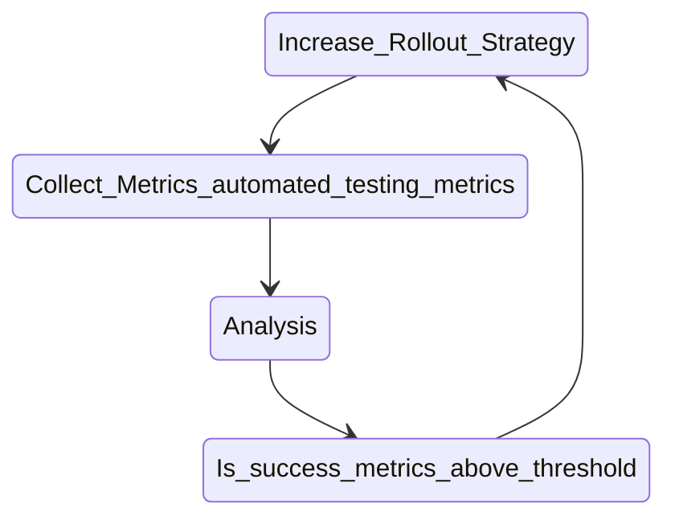

# Deployment Strategies

There are many strategies for deploying out code to Production.

* Big Bang Deployment
* Rolling Deployment
* Blue-Green Deployment
* Canary Deployment
* Feature Toggle

## Big Bang Deployment

This is the oldest strategy, wherein we deploy the entire new version and replace the old one. This requires a downtime, where we would be shutting down the old version instances and deploying the new one. This downtime can be small. But, the back-out strategy can be hard to implement if the deployment does not go as planned. Sometimes this might be the only choice - for example, when the intricate database upgrades are involved.

## Rolling Deployment

It is more like a marathon than a sprint. In this method, we upgrade parts of the period over time. This is a staged rollout. This can server by server, until the entire system is updated. One of the advantages of this deployment is that it usually prevents downtime. Another advantage is that we can spot issues early on, and we can handle them, which can reduce the risk of wide scale problems. The downside of this deployment is that it is typically very slow process and may take hours or even days to complete. Also, if we miss the initial issues, we may still end up propagating widespread problems. This strategy also does not support targeted rollout - the new version can be service any random user, although we can direct users to new version based on some criteria like location, device tyoe, etc.

This is a popular choice by many team since it balances risk and user impacts in a methodical way.

## Blue-Green Deployment

Here we maintain two identical systems - at any given time, one side is active and visible to users (blue) and other side is idle and invisible to user and hence ready for new version (green). We can safely deploy and test new version in green environment. Once the testing is successful, we simply switch the load-balancer to point to this green environment.

This is no downtime. In case of any problem, we can immediately roll back the deployment to the previous version by again simply repointing to load-balance to the blue one.

Disadvantage is that switchover from the old to new version for all users happens at once. It is also resource intensive - maintaining two identical production environment. Also, maintaining syncs around the databases, and third parties services can be significantly difficult.

This still remains one of the most popular strategies due to smooth user experience and reliable rollbacks.

## Canary deployment

In this strategy, we test our air before full scale deployment is made. We choose a set of servers or group of users to target (often based on some criteria) for deployment. The target infra can be a single server, a cluster or one whole region - the goal to keep it small as compared to whole user base. Once the new version performs well, the rest of the infrastructure is upgraded to the new version. If something goes wrong, we can fix the issues without impacting all the users (but a small section of users, who can be pointed to the old version as well).

This strategy allows targeted setup. However, this comes with additional requirement for automated testing and metrics collection and verification.

This can be more challenging if there are database schema changes or system runs into API compatibility issues.

Typically, canary deployment does not happen alone. It is usually complemented by rolling strategy to get the best of both worlds.

## Feature Toggle

This is used for enabling or disable a new feature within the system. It allows us to control who can see the new feature. It can be used along with other above strategies. It can be used for targeted A/B testing for some users.

However, if managed properly the code base can become overly complicated, and code cleanup needs to happen frequently.