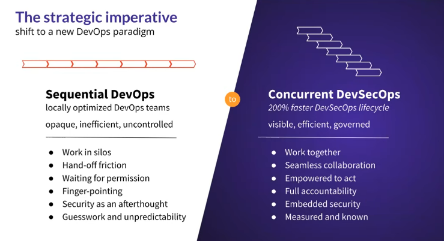
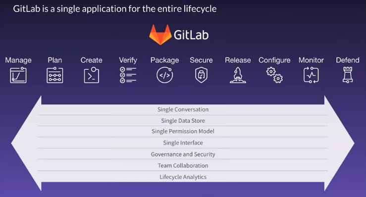
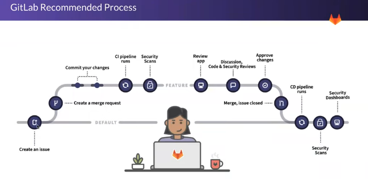
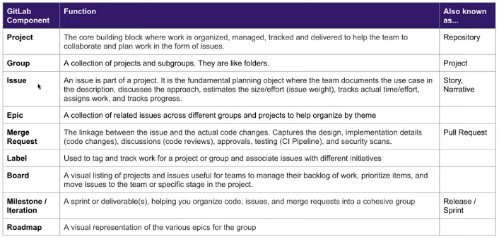
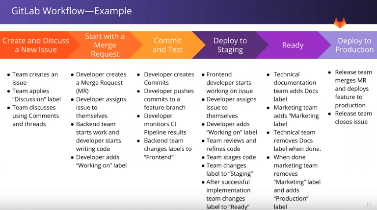
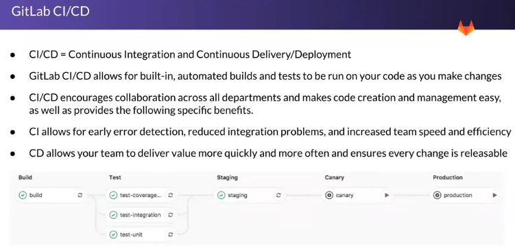

# GitLab

Started as a Git repository manager. Later grew to add CI/CD and became fully grown DevOps Lifecycle tool. It has also wiki and issue tracking.

GitLab is Open source. Monthly releases - 22nd of every month.

Sequential DevOps process to Concurrent DevSecOps



## Concurrent DevSecOps Lifecycle with GitLab

**Problem**: **Dev**[Plan -> Create -> Verify -> Package] -> **Ops**[Release -> Configure -> Monitor]: **Solutions**

GitLab provides
* Single Platform
* Single Data Model
* Simple & Secure
* Transparent



## DevSecOps Process



* On the main branch
  * Create an issue (Branch??)
  * Create a merge request (Automated isolated feature branch)
* Within isolated feature branch
  * Commit your changes
  * CI pipeline runs
  * Security Scan
  * Review app (_Containerized app for review_)
  * Discussion, Code & Security reviews
  * Approve changes (Optional)
  * Merge, issue closed.
* On the main branch
  * CD pipeline runs
  * Security Scans
  * Security Dashboards

> Can we get multiple approval?? One of ITOps, InfoSec, etc.

## GitLab Workflow Components



## GitLab Nodes
Permissions flow from the top and can be set up any level. I think it might make sense for product.

Group can be just there as a collection purpose.

## GitLab Workflow - Example



> Label can be used to show workflow stages (and triggers, I guess??).

Learn about - Scope Label and Simple Label

Approval Group Setting - who can approval


GitLab version of Markdown is used for content creation.

## GitLab CI/CD



### Pipelines

GitLab pipeline is a version controlled yaml file ```.gitlab-ci.yml``` which sits in a GitLab project root. It has two main components -
* Jobs: They describe the tasks that need to be done like compile, test, package or deploy.
* Stages: They define the order in which jobs will be completed.
In essence, a pipeline is a set of instruction for a program to execute. The program which runs the jobs in a GitLab is called a ```GitLab Runner```.

GitLab Runner is a separate program that can be run on your localhost, VM or even container. It is similar to the concept of a Jenkins Agent. GitLab assigns pipeline jobs to available runners at pipeline runtime.

> Use GitLab Editor to create pipeline if we do not want to use a temple. There is GitLab workflow extension in VS Code

Sample .gitlab-ci.yml
```yaml
stages:
  - build
  - test
  - deploy

build-job:
  stage: build
  script:
    - echo "Compiling the code..."
    - echo "Compile complete"
    - mkdir build/
    - echo "My application binary file" > build/executive-binary-file-v1
  artifacts:
    paths:
      - build/executive-binary-file-v1
  
unit-test-job:
  stage: test
  script:
    - cat $CI_PROJECT_DIR/build/executive-binary-file-v1
    - echo "Completed unit test"

lint-test-job:
  stage: test
  script:
    - echo "Begining lint test"
    - echo "Completed lint test"

deploy-job:
  stage: deploy
  script:
    - echo "Begining deployment"
    - echo "Completed deployment"
```

GitLab recommends usage of Docker dependency management. In case we need python for our project 

```yaml
image: python:latest
stages:
  - build
  - test
  - deploy

build-job:
  stage: build
  script:
    - echo "Compiling the code..."
    - echo "Compile complete"
    - mkdir build/
    - echo "My application binary file" > build/executive-binary-file-v1
  artifacts:
    paths:
      - build/executive-binary-file-v1
  
unit-test-job:
  stage: test
  script:
    - cat $CI_PROJECT_DIR/build/executive-binary-file-v1
    - echo "Completed unit test"

lint-test-job:
  stage: test
  script:
    - echo "Begining lint test"
    - echo "Completed lint test"

deploy-job:
  stage: deploy
  script:
    - echo "Begining deployment"
    - python3 --version
    - echo "Completed deployment"
```

> Once we build our code, it needs to push the image into some repository (GitLab container registry or Nexus)


**GitLab setup for environment variable**. Some of sensitive variables like variables can be set using Settings -> Variable.
```yaml
image: python:latest
variable:
  USERNAME: test_user
    
stages:
  - build
  - test
  - deploy

build-job:
  stage: build
  script:
    - echo "Compiling the code..."
    - echo "Compile complete"
    - mkdir build/
    - echo "My application binary file" > build/executive-binary-file-v1
  artifacts:
    paths:
      - build/executive-binary-file-v1
  
unit-test-job:
  stage: test
  script:
    - cat $CI_PROJECT_DIR/build/executive-binary-file-v1
    - echo "Completed unit test"

lint-test-job:
  stage: test
  script:
    - echo "Begining lint test"
    - echo "Completed lint test"

deploy-job:
  stage: deploy
  script:
    - echo "Begining deployment"
    - python3 --version
    - echo "Deploying using credentials - $USERNAME and $PASSWORD"
    - echo "Completed deployment"
```

> We should use specific GitLab Runner, so we can use our own compute.

> We can use caching, so it does not keep downloading dependencies all the time. Refer to [documentation](https://docs.gitlab.com/ee/ci/caching/index.html)

https://docs.gitlab.com/ee/ci/