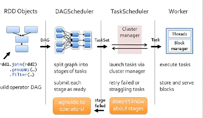

# Introduction to AmpLab Spark Internals
**Dec 21, 2021** Learning from [YouTube](https://www.youtube.com/watch?v=49Hr5xZyTEA)

## Concept of RDD
A Resilient Distributed Dataset (RDD), the basic abstraction in Spark. Represents an immutable, partitioned collection of elements that can be operated on in parallel. 

RDD itself is an abstract class with implementation as HadoopRDD (RDD which knows its path in HDFS) or FilteredRDD(RDD which is output of a filter function that we gave it and knows if it should cached or not). We understand the dataset in terms of partitions - think of these as blocks in your file. So, the system understands the dependencies for each partition. The task, attached to each partition would try to pipeline as much data processing it can within each partition.

### Data Locality - 
First run: data not in cache, so use HadoopRDD's locality prefs (from HDFS)
Second Run: FilteredRDD is in cache, so use its locations. If something falls out of cache, go back to HDFS.

## Scheduling Process

When an action is called, it gets submitted to DAGScheduler. 
DAGScheduler builds ups the graph at the partition level, which knows the dependencies at the partition level. It is then split the graph into stages of tasks (reduce task) - it would then submit each stage as ready. It does not anything about any Spark operator.
The stage is called TaskScheduler. Its job is to run task on cluster. Its job is simple - take the task which it gets, finish and update the DAGScheduler when done. It does not care about stages (what comes before or after). Boundary of the stage is the shuffle - basically complete all the map tasks and then go for shuffle - this is where new stage would be called. Task scheduler uses cluster manager to allocate these task on a worker. It does not know any dependency between stages. The way tasks are shipped is via Scala closure objects which are points to the code.
Work is nothing but a number of threads that can run a task and cache RDD within a Block manager.

## RDD Abstraction
Goal: Wanted to support wide array of operators and let users compose them arbitrarily. Don't want to modify schedule for each one. _How to capture dependencies generally?_
This is where RDD Interface came into play. Each RDD is characterized by five main properties:
- A list of splits (partitions)
- A function for computing each split given parents
- A list of dependencies on other RDDs (parent RDD)
- Optionally, a Partitioner for key-value RDDs (e.g. to say that the RDD is hash-partitioned)
- Optionally, a list of preferred locations to compute each split on (e.g. block locations for HDFS)

All the scheduling and execution in Spark is done based on these methods, allowing each RDD to implement its own way of computing itself.

This class also contains transformation methods available on all RDDs (e.g. map and filter). In addition, PairRDDFunctions contains extra methods available on RDDs of key-value pairs, and SequenceFileRDDFunctions contains extra methods for saving RDDs to Hadoop SequenceFiles.

**See some implementations** HadoopRDD, FilteredRDD, JoinedRDD

## Dependency Types
ZTest