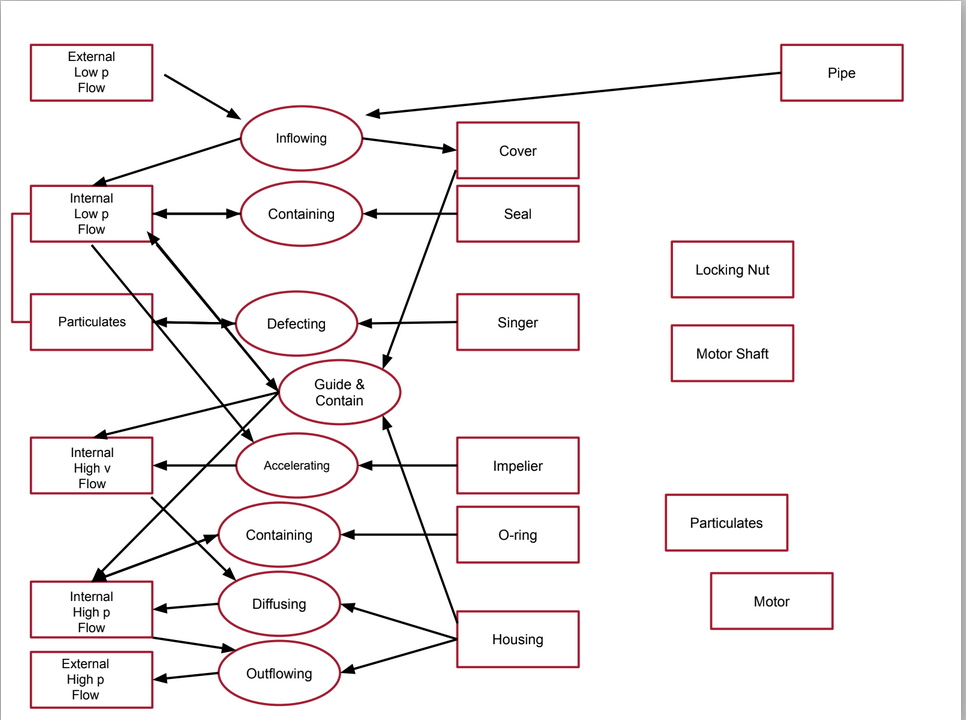

# System Design

## Modern System Architecture

System architecture is the study of early decision-making in complex systems. We will first learn how to capture experience and analysis about early system decisions. We will also learn you how to choose architectures that meet stakeholder needs, integrate easily, and evolve flexibly.

Most importantly, we’ll examine how to think, not what to think. The goal is to help develop a way of thinking about and implementing system architecture by placing it in the context of value and competitive advantage for the product and organization.

We’ll learn to manage the evolution of system complexity and account for future uncertainty so goals are met and functions are delivered. This will also ensure that the system remains fully comprehensible during its design, implementation, operation, and evolution.

The framework starts by defining the solution-neutral function based on the underlying need. Then comes the concept, which is generated based on the solution-neutral function. Finally, the architecture is created based on the concept.

This tool is called Design Structure Matrix (DSM). DSM helps you understand the interactions among entities, subsystems, and components. It also allows you to manage these interactions to align product development with the goals and needs of the system.

## Key Ideas

Function to architecture. Solution neutral functions. Concept.

The requirement should be provided in a solution neutral way, so it allows designers to bring in different ways to solve a problem.

Definitions:

* **Architecture** is a representation of entities organized in a way that supports reasoning about the entities and describes behaviors and relationships amongst the entities.
* A **concept** is a product or system vision, idea, notion, or mental image that maps function to form in brief. It is a simplification of the system architecture that allows for high-level reasoning.
* A **solution-neutral** function explains a function without specifying the solution that allows one to achieve that function. Solution-neutral is not an absolute property but rather a spectrum of more solution-neutral to less solution-neutral.

Examples of solution-neutral and solution-specific

|Solution-Neutral       |Solution-Specific              |
|-----------------------|-------------------------------|
|Controlling a vehicle  |Steering a vehicle             |
|Sorting an Array       |Sequentially exchanging entries|
|Identifying a package  |Lidar Scanning                 |
|Air pressure regulating|Actuating Blow Off value       |

Please note: Solution-neutral is relative, not absolute. Any requirement is more or less solution-neutral relative to another possible requirement. This spectrum is illustrated by the range of problem framings given in the video for a wine bottle opener.

> * Solution-neutral function is stated without reference to how the function is achieved.
> * Functional intent for a system should be stated as a solution-neutral function.
> * A solution-neutral statement doesn’t contain any reference to a specific product/process, so it doesn’t set the design parameters.

Less solution-neutral is focus and team's exploratory perspective is constrained. Useful is responding to a competition or challenge.

### Concept

You're already familiar with concepts such as the vision, or the idea, or the kernel at the heart of the architecture. Professor Cameron, from MIT xPro argues that concept requires both function (process) and form (operand) and defines it as the mapping of function to form.

If you list down the number of functions you need to perform, and all the forms that can do these functions individually, we can generate a lot of concepts using their combinations.

|x                         |Operand|Process |Instrument|
|--------------------------|-------|--------|----------|
|Operand/Process/Instrument|light  |emitting|diode     |
|Operand/Process           |lawn   |mow     |(er)      |
|Operand/Instrument        |light  |        |bulb      |
|Process/Instrument        |       |carrying|case      |

The concept name can lock us in some kind of solution.

Architect Steve Emerie rationalizes the structure of the architecture.

In summary, a concept:

* Is the transition point from the solution-neutral to the solution-specific.
* Must allow for value-related functions to be executed and enabled by form.
* Establishes the vocabulary for the solution and is the beginning of the development of architecture.
* Implicitly sets the design parameters of the system.
* Implicitly sets the level of technology

## System Architecture

The system concept is simple: It has a low amount of information and complexity. The architecture is quite complex — a lot of information involved.

Stepping Stones in Synthesis

1. Needs - It is vague. It is in the language in common people. It **answers why** are doing.
2. Functional goals - **Solution-neutral vocabulary**, which can be defined by someone in the system. It **answers what** is the system going to do.
3. Concept - **How** will the system perform the functional goals.
4. Architecture - It defines the concept in a **solution-specific vocabulary**.

Concept informs architecture. It not only conveys information about form but also contains information about function. Solution-neutral format by definition does not reference a specific solution. It scopes how broad a design exploration will be. Therefore, it is possible to use a solution-neutral statement that is too broad, which may encourage a team to embark on an exploration that takes too much design time.

See an example of system architecture solving a simple need to removing water from the basement.

### Decisioning in System Architecture

We have no reason to expect the quality of intuition to improve with the importance of the problem. Perhaps the contrary: high-stake problems are likely to involve powerful emotions and strong impulses to action - Daniel Kahneman.

Engineers must make many design decisions. A subset of these design decisions are architectural decisions — arguably the most important decisions. They relate to

* Mapping function to form
* Determining the performance envelope
* Encoding the key trade-offs that become the eventual product.

Lets introduce two more concerns here which would influence decisions feeding into System Architecture - Sensitivity and Connectivity.

**Sensitivity** is a measure of the impact on metrics caused by a given decision.
**Connectivity** is the degree to which making a given decision influences other decisions. This shows how much rework would be required to make change the decision. A connected architectural decisions affect multiple subsystems or components within the system. In such cases, changing a connected architectural decision is more difficult as time progresses and things are added to the system.

Professor Cameron argues that with two critical criteria you can highlight the architectural decisions for the system. Those architectural decisions should be both highly sensitive as well as highly connected.

Quadrant 1 is what we want to solve first - they would help fix my design. Quandrant 4 can be done at the last - these decisions can be done downstream.

## Design Structure Matrix

Design Structure Matrix is a method for mapping out or modeling networks of interactions in complex engineering systems. This is used to better manage the development of extensive development projects, which are naturally decomposed or split into different pieces.

- **Decomposition** is the breaking a larger entity into smaller entities.
- **Process** is a pattern of transformation applied to one or more objects. Generally, processes are creating, destroying, or changing something. They occur over time.
- **Design Structure Matrix (DSM)** is a simple complacent representation of a system or project in the form of a square matrix. It is the equivalent of an adjacency matrix in graph theory and is used in system engineering and project management to model the structure of complex systems or processes.
- **System architecture** is the embodiment of the concept that the allocation of physical information function to the elements of form and the definition of relationship among the elements and with the surrounding context.
- **Interface** is a point where two systems meet and interact. 
- **Process architecture** is the structural design of general process systems.

Product - Is decomposed into Sub-System and Components
Process - Is decomposed into Phases and Stages, finally into Work packages and Tasks. Planning-> Concept Development -> System-Level Design -> Design -> Build -> Test -> Production ramp-up
Organization -> Is decomposed into people and team to execute the process to create the system.

Product/System DSM is a square matrix which lists components on x and y axis, and denote interfaces with x, and squares to denote the sub-systems, and common interfaces with runs throughout the systems.

Process Architecture DSM

## Table of Content

1. [CPU Concepts](cpu-concepts.md)
2. [Modules and Functions](design-principles/program-structure.md)
3. [Cohesion and Coupling](design-principles/cohesion-coupling.md)
4. [Procedural and Object-Oriented Design](to-be-filled)
5. [Functional and Object-Oriented Design](design-principles/FPvsOOP.md)
6. [Inheritance and Composition](design-principles/inheritance-composition.md)
7. [SOLID](design-principles/solid-design-principle.md)
8. [Design Patterns](design-patterns/design-patterns.md)
9. [Language Perspective](programming-language-perspective/README.md)
