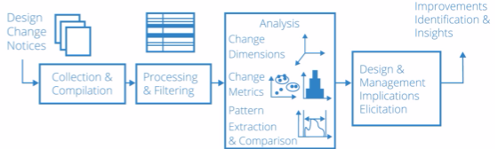
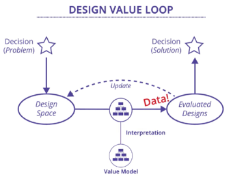
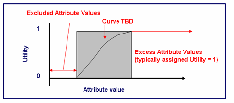
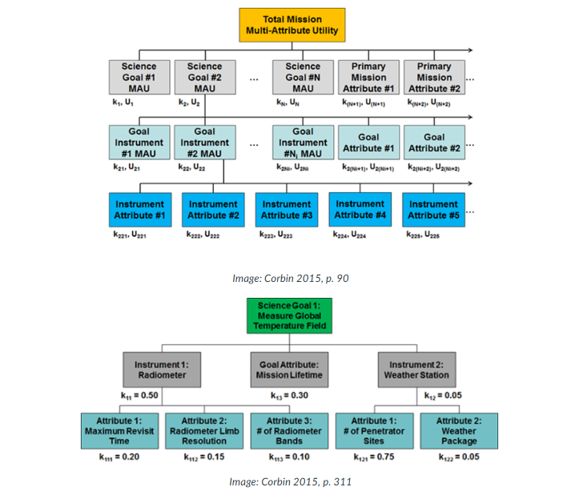

# Modern System Architecture

System architecture is the study of early decision-making in complex systems. We will first learn how to capture experience and analysis about early system decisions. We will also learn you how to choose architectures that meet stakeholder needs, integrate easily, and evolve flexibly.

Most importantly, we’ll examine how to think, not what to think. The goal is to help develop a way of thinking about and implementing system architecture by placing it in the context of value and competitive advantage for the product and organization.

We’ll learn to manage the evolution of system complexity and account for future uncertainty so goals are met and functions are delivered. This will also ensure that the system remains fully comprehensible during its design, implementation, operation, and evolution.

The framework starts by defining the solution-neutral function based on the underlying need. Then comes the concept, which is generated based on the solution-neutral function. Finally, the architecture is created based on the concept.

This tool is called Design Structure Matrix (DSM). DSM helps you understand the interactions among entities, subsystems, and components. It also allows you to manage these interactions to align product development with the goals and needs of the system.

## Key Ideas

Function to architecture. Solution neutral functions. Concept.

The requirement should be provided in a solution neutral way, so it allows designers to bring in different ways to solve a problem.

Definitions:

* **Architecture** is a representation of entities organized in a way that supports reasoning about the entities and describes behaviors and relationships amongst the entities.
* A **concept** is a product or system vision, idea, notion, or mental image that maps function to form in brief. It is a simplification of the system architecture that allows for high-level reasoning.
* A **solution-neutral** function explains a function without specifying the solution that allows one to achieve that function. Solution-neutral is not an absolute property but rather a spectrum of more solution-neutral to less solution-neutral.

Examples of solution-neutral and solution-specific

|Solution-Neutral       |Solution-Specific              |
|-----------------------|-------------------------------|
|Controlling a vehicle  |Steering a vehicle             |
|Sorting an Array       |Sequentially exchanging entries|
|Identifying a package  |Lidar Scanning                 |
|Air pressure regulating|Actuating Blow Off value       |

Please note: Solution-neutral is relative, not absolute. Any requirement is more or less solution-neutral relative to another possible requirement. This spectrum is illustrated by the range of problem framings given in the video for a wine bottle opener.

> * Solution-neutral function is stated without reference to how the function is achieved.
> * Functional intent for a system should be stated as a solution-neutral function.
> * A solution-neutral statement doesn’t contain any reference to a specific product/process, so it doesn’t set the design parameters.

Less solution-neutral is focus and team's exploratory perspective is constrained. Useful is responding to a competition or challenge.

### Concept

You're already familiar with concepts such as the vision, or the idea, or the kernel at the heart of the architecture. Professor Cameron, from MIT xPro argues that concept requires both function (process) and form (operand) and defines it as the mapping of function to form.

If you list down the number of functions you need to perform, and all the forms that can do these functions individually, we can generate a lot of concepts using their combinations.

|x                         |Operand|Process |Instrument|
|--------------------------|-------|--------|----------|
|Operand/Process/Instrument|light  |emitting|diode     |
|Operand/Process           |lawn   |mow     |(er)      |
|Operand/Instrument        |light  |        |bulb      |
|Process/Instrument        |       |carrying|case      |

The concept name can lock us in some kind of solution.

Architect Steve Emerie rationalizes the structure of the architecture.

In summary, a concept:

* Is the transition point from the solution-neutral to the solution-specific.
* Must allow for value-related functions to be executed and enabled by form.
* Establishes the vocabulary for the solution and is the beginning of the development of architecture.
* Implicitly sets the design parameters of the system.
* Implicitly sets the level of technology

## System Architecture

The system concept is simple: It has a low amount of information and complexity. The architecture is quite complex — a lot of information involved.

Stepping Stones in Synthesis

1. Needs - It is vague. It is in the language in common people. It **answers why** are doing.
2. Functional goals - **Solution-neutral vocabulary**, which can be defined by someone in the system. It **answers what** is the system going to do.
3. Concept - **How** will the system perform the functional goals.
4. Architecture - It defines the concept in a **solution-specific vocabulary**.

Concept informs architecture. It not only conveys information about form but also contains information about function. Solution-neutral format by definition does not reference a specific solution. It scopes how broad a design exploration will be. Therefore, it is possible to use a solution-neutral statement that is too broad, which may encourage a team to embark on an exploration that takes too much design time.

See an example of system architecture solving a simple need to removing water from the basement.


### Decisioning in System Architecture

We have no reason to expect the quality of intuition to improve with the importance of the problem. Perhaps the contrary: high-stake problems are likely to involve powerful emotions and strong impulses to action - Daniel Kahneman.

Engineers must make many design decisions. A subset of these design decisions are architectural decisions — arguably the most important decisions. They relate to

* Mapping function to form
* Determining the performance envelope
* Encoding the key trade-offs that become the eventual product.

Lets introduce two more concerns here which would influence decisions feeding into System Architecture - Sensitivity and Connectivity.

**Sensitivity** is a measure of the impact on metrics caused by a given decision.
**Connectivity** is the degree to which making a given decision influences other decisions. This shows how much rework would be required to make change the decision. A connected architectural decisions affect multiple subsystems or components within the system. In such cases, changing a connected architectural decision is more difficult as time progresses and things are added to the system.

Professor Cameron argues that with two critical criteria you can highlight the architectural decisions for the system. Those architectural decisions should be both highly sensitive as well as highly connected.


Quadrant 1 is what we want to solve first - they would help fix my design. Quandrant 4 can be done at the last - these decisions can be done downstream.

## Design Structure Matrix

You can learn more about DSM at their [website](https://dsmweb.org/)

Design Structure Matrix is a method for mapping out or modeling networks of interactions in complex engineering systems. This is used to better manage the development of extensive development projects, which are naturally decomposed or split into different pieces.

- **Decomposition** is the breaking a larger entity into smaller entities.
- **Process** is a pattern of transformation applied to one or more objects. Generally, processes are creating, destroying, or changing something. They occur over time.
- **Design Structure Matrix (DSM)** is a simple complacent representation of a system or project in the form of a square matrix. It is the equivalent of an adjacency matrix in graph theory and is used in system engineering and project management to model the structure of complex systems or processes.
- **System architecture** is the embodiment of the concept that the allocation of physical information function to the elements of form and the definition of relationship among the elements and with the surrounding context.
- **Interface** is a point where two systems meet and interact. 
- **Process architecture** is the structural design of general process systems.

Product - Is decomposed into Sub-System and Components
Process - Is decomposed into Phases and Stages, finally into Work packages and Tasks. Planning-> Concept Development -> System-Level Design -> Design -> Build -> Test -> Production ramp-up
Organization -> Is decomposed into people and team to execute the process to create the system.

### Type of DSM

**Product/System DSM** is a square matrix which lists components on x and y axis, and denoting interfaces with x. You would note a pattern of how x are placed, and some related components may denote the sub-systems, and common or integrating components which run throughout the system.

**Process Architecture DSM** is an activity to activity square matrix.

**Organizational DSM**

### How does this work?
DSM is represented as a square N x N matrix, mapping the interactions among a set of N system elements. The system elements are often labeled in the rows to the left of the matrix and in the columns above the matrix. 

The off-diagonal elements are used to indicate relationships between the elements. A marking of the cell indicates a directed link between two elements. It can represent design relations or constraints between product components, communication between teams, information flow, or relations between activities. In one convention, reading across a row reveals the inputs that the element in that row receives from other elements. Scanning a column reveals the outputs that the element in that column provides to other elements. Alternatively, the rows and columns may be switched (without a change of meaning). Both conventions may be found in the literature and convey the same information. 

Here, you will begin by adopting the convention with outputs in rows and inputs in columns. For example, in the figure below, the eight system elements are labeled A–H across both rows and columns. Reading across Row B, you’ll see that B has inputs from D, F, and G represented by “X” marks in Row B. Reading down Column F, you’ll see that F has outputs going to B and D. Thus, the mark in off-diagonal cell (B, F) represents an interaction that is both an input and an output, depending on whether one takes the perspective of its provider (Column F) or receiver (Row B).

|x|A|B|C|D|E|F|G|H|
|-|-|-|-|-|-|-|-|-|
|A|A| | | |X| | | |
|B| |B| |X| |X|X| |
|C| | |C|X| | | |X|
|D|X|X| |D| | | | |
|E| |X| | |E| | | |
|F| | | | |X|F| | |
|G| | |X| | | |G| |
|H| | | | |X| | |H|

> A DSM can be sorted to identify potential groups that have more connections within the group and fewer connections outside the group.

> Processes are generally feed forward in nature (represented by marks below the diagonal). Feedback processes that return some input back to an upstream task (represented by marks above the diagonal) are rarer. Mainly validation and verification tasks have a feedback nature. Hence, Process DSMs have more marks below the diagonal than above the diagonal in the DSM square matrix.

> System architecture DSMs are mostly symmetric. We represent interfaces or interactions between the components, which are generally symmetric in nature. If one component has an interface with another, then vice versa is also true.

> Process architecture DSMs are mostly asymmetric. Processes are mostly feed forward in nature, i.e., one process's output is required as input for another process. Information, in this case, may not be passed in the opposite direction.

> A system architecture DSM is often called an N-squared matrix. This refers to the fact that the matrix is square — it has the same number of rows and columns. As shown in the video, it can be used to visualize relationships and with clustering algorithms to produce potential modularizations of the system.


### Advantages of Design Structure Matrix

Within the suites of potential system analysis tools, DSM offers some salient advantages:

- **Conciseness**: The structured N x N arrangement of elements and interactions provide a compact representation.
- **Visualization**: By looking at a DSM matrix alone, a designer can distinguish relationship patterns of particular interest. For example, a DSM may show regions of heavy interactions indicative of assigning particular components to a module.
- **Comprehension**: It’s easy to understand. Hierarchy and complexity become apparent in even a cursory review of the DSM.
- **Analysis and optimization potential**: The matrix-based nature of DSM allows application to a number of power analyses in graph theory, matrix mathematics, and specialized DSM analysis methods. These tools can be used to optimize the structure, modularity, and other important patterns and effects.

### Creating a System Architecture DSM

The steps covered can be generalized to provide a basic framework for building a product architecture DSM:
1. Decompose the system into elements.
2. Understand and document the interactions between the elements.
3. Layout the square DSM with components, labeling the rows and the columns.
4. Analyze potential groupings of the elements via clustering. The clustering should be done in such a way that it promotes interactions within the cluster and minimizes outside ones.

### Process Architecture DSM

Process Architecture represents the flow of information between tasks that makes up the development process. There are three kinds of relationship possible between two tasks

* Sequential: Task A provides information to task B, and hence must complete before B. Task B is dependent on A, and A and B are therefore, sequential.
* Parallel: If Task A and B are independent of each other, so both can be done at once in parallel.
* Coupled: Task A and B can be interdependent - this means, A needs something from B and B needs something from A. They must be done together and hence are coupled.

In Process Architecture DSM, the inputs are in the row and outputs are in the column. In the diagram below, Task D requires input from E, F, and H. Task B's output goes to C, E and G  

|x|A|B|C|D|E|F|G|H|
|-|-|-|-|-|-|-|-|-|
|A|A| | | |X| | | |
|B| |B| |X| |X|X| |
|C| |X|C|X| | | |X|
|D| | | |D|X|X| |X|
|E| |X| | |E| | | |
|F| | | | |X|F| | |
|G| |X|X| | | |G| |
|H| | | | |X| | |H|

Which task should go first? Well, it may the one with no input or minimum inputs. Once that task is complete, we can find the ones which needs the output of this with no other or minimum inputs. We can thereby sequence the entire process. Once you put the DSM in that sequence, we can move across to diagonal to see when the task can be done in sequence, parallel, or are coupled. So, process DSM can help identify -
1. Tasks that can be executed in parallel
2. The order in which tasks should be executed
3. Tasks that have to be performed together as a logical group because of their dependencies

Lets create the algorithm for the same.

#### DSM Sequencing model

1. Find any empty rows and move them to the front.
2. Find any empty columns and move them to the end.
3. Find any loop (if A depends of B and B depends on A, they are looped), collapse it, and schedule it according to step 1 and 2, if possible.
4. Repeat steps 1-3 until all the tasks and loops have been sequenced.

// Task - Create a python program to do so.

Process DSM allows us to answer the question - where are the iterations in an engineering process? There are planned and unplanned iterations. Planned iterations are the ones where we group task together to iterate to get the best outcome. Our job to make them happen faster. Unplanned iterations are hard to predict when it would take place. We can plan to remove or plan not to create the knock down impact.

> Any activity that lies above the diagonal in the process DSM is a feedback activity.

> Any feedback activity that is not part of a logical group leads to unplanned iteration.

> Any feedforward or feedback activities happening inside a logical group are part of planned iterations.

> Sometimes if a process contains all uncoupled tasks, then restructuring the DSM will not lead to other improvements. Rearranging the DSM may not always help. If a process contains only uncoupled tasks, then restructuring the DSM will not lead to other improvements. Note that the use of logical groups defines what is planned/unplanned. Therefore, what is outside the logical groups is unplanned. For iterative processes, in theory you could illustrate the whole DSM as a logical group, but in practice when performing tasks, in the second iteration there may be differences from the first iteration.

#### How to create a process Architecture DSM

1. Identify the process or of the sub-process to model - the inner working of the sub-systems
2. Identify the tasks and who is responsible for each one
3. List the outputs created by each task
4. Identify the inputs for each task
5. We can then mark X to match "input requirement for" (rows) and "output created by" (columns).
6. We can then mark 0 or something to mark special flows like unplanned iteration - they would be typical above the diagnal.
7. You can then sequence tasks differently, use different colors, markers, etc. to make sense for yourself. There is no right or wrong ones here.

## Decomposing a System

Architect decides on the decomposition of a system. It is a divide and conquer rule. Once they decide, many things emerge -
1. Interfaces
2. Approaches to testing
3. Ease of integration
4. Approaches to service

Two key decisions are to be made. The core decision is how many pieces do you want to decompose into, typically 7 +- 2. But the more subtle decision is to determine which **plane** you want to use - is it based on **form**, **function**, **suppliers**, **sequence of operations**, etc. We will get different decomposition based on what we select.

Irrespective of how we decompose, all of these need to derive from top-level system performance requirement.

To decompose, we can use **Two Down, One Up** principle that says the best information about how to cluster or group the system one level down from the reference is present in the structure and interactions two levels down. Therefore, you need to drill down to Level Two to better identify the Level One decomposition.

Level 0 -> Trial Level 1 decomposition -> Trial Level 2 decomposition -> Apply Clustering Algorithm as described in DSM process -> Final Level 1 decomposition

### Key take away

We want to modularize the system, keeping the following things mind -

1. Reduce and simplify the interfaces
2. Reduce the functional interactions and ensure emergence can take place
3. Modularize for easy implementation, integration, operation, and service
4. System changeability over lifetime
5. Modularize against legacy elements and suppliers

> Remember good modularization is the key to managing complexity in system.

We can have a great architecture if we can -
1. Decompose that modularize in the same way across all the planes
2. Create simple interfaces
3. Have teams aligned with the modules

## Change Propagation

Most products and systems emerge from predecessors and not through clean-sheet design. Understanding how and why changes propagate during engineering design is, therefore, critically important. Even new product development projects are iterative in nature with many build and test cycles that may result in frequent requirement updates. This can cause change propagation within the system. A change request can potentially propagate through a system to other components, leading to increases in project cost and lead time.

**Change propagation** is the process by which change to one part or element of an existing system configuration or design results in one or more additional changes to that same system.

Change propagation often exceeds two generations (child to child) but rarely exceed five generations (child to child to child to child to child). It follow Log-linear distribution - any change deeper than 5 generation are significantly small to be made.

Understanding change propagation impact is important to ensure that we are able to deliver the value (emergence) by the system with time and budget.

// To read - how to predict this efficiently.

It is important to track and document Engineering change history. We can them have an approach to engineering change analysis.

Three dimensions to capture in Engineering change history.

1. Time: Change activity over project timeline. If we draw a 2-D plot of change of necessary changes vs time, we may see three patterns. Most changes occur before the finalization of design and tapper down very quickly after the initial set of changes, these are probably good and are called Ripple. We may see another kind where changes occur before finalization of design, but the changes does not really tapper until the middle of the design and may have at the fag end as well. These are called Blossom and not really considered good. The worst kind is when the changes continue to happen even after the change and are called Avalanches.
2. Change Location: We would like to understand when and where these change are happens. It helps identifying the hotspots in the system.
3. Cost: Cost distributions. We want to look at which changes are causing additional cost or scope, changes which reduces cost/scope neutral, and changes with are cost/scope neutral against time. It is generally found that any change post design phase and when the build starts increase cost/scope. There is a cost estimate bias - we tend to underestimate the cost escalation due to change, and overestimate the cost saving due to change.



We should also look into social network of people involved in a system, and the role some of integration/system engineers play during the change process.

## Value based decisioning

**Value** is the experienced net benefit at a cost, taking into account the importance and scarcity, that will result from the system. Different stakeholders will perceive value differently and it is likely to vary over time.

When making decisions, people often focus on a single criterion like price, but most decisions actually involve multiple, competing criteria. For instance, buying groceries involves both price and quality. In complex systems like designing a smartphone, multiple stakeholders have different needs. Users prioritize factors like battery life and camera quality, while manufacturers focus on production costs and timelines. It’s challenging to balance these diverse needs, so a structured process is needed to efficiently compare attributes, identify conflicts and synergies, and make better decisions.

### Traceability and Communication Support
One of the key benefits of engaging with stakeholders early and using value-focused thinking is that it increases the likelihood of success at decision time. Most systems engineering processes have key milestone reviews, the outcome of which are critical decisions that shape what a system can end up becoming. These include decisions such as concept selection, budget, and schedule allocation; requirements encoding; assigning specifications to a design; verification that a particular design meets requirements; and validation that a particular system meets the espoused needs.

Every organization may have a different set of processes and key milestones; however, usually, these are the critical times when preferences (i.e., the values) of critical stakeholders are made known. Sometimes key stakeholder needs are not even known until later in the lifecycle (i.e., new customers using a product after development). In order to reduce delays in the system development processes and increase the chances that the proposed system solutions meet or exceed expectations, you can use quantitative methods to generate compelling and aligned evidence that you are developing good solutions. For example, using quantitative value models as proxies for stakeholder needs ensures alignment of your development efforts in between those critical milestone reviews.

A **decision-maker** is a special type of stakeholder who has influence or control over driving the needs and setting up goals for the system.

An **attribute** is a decision maker’s perceived metric of how well a perceived objective is met.

**Value metric** converts the attributes of a design into a measure of preference(s) of the decision-makers, thereby aiding them in choosing between disparate alternatives. Value metrics are quantitative, although they are often dimensionless and may be relative.

The Pareto frontier by definition contains alternatives that are the most efficient for a given cost. Therefore, if an alternative has a higher benefit than other alternatives at a given cost, then that alternative will now be a part of the Pareto frontier.

**Budget** and **desires constraints** represent limitations on what is acceptable for the project and system, and they can be used to eliminate alternatives from the decision analysis, since some alternatives will not satisfy them.

Dominated solutions are not the most optimal from the set of all of the available solutions, and therefore they don't maximize the value that could be derived from the system; hence, they could be eliminated. However, if you have any uncertainty about the value metrics, the performance, or cost of the alternatives, or wish to gain insights into the relationships within the tradespace, you should not eliminate dominated solutions, since they might become non-dominated at a later point in time (to be discussed in the coming weeks).

Multi-Attribute Tradespace exploration
* Structured framework
* Large number of alternatives
* Useful mechanism for stakeholder communication

Finding alternatives on the basis of experience, media, reports, etc.

Differentiating factors:

- Price
- Styling
- Reliability

Finding alternatives, and creating differentiation takes time and effort.

Value focused thinking
1. Starts with rationales
2. How do you create value?
3. What is the problem you are trying to solve?
4. Ideally these are solution neutral.

|Value-Focused|Alternative-Focused|
|-------------|-------------------|
|Focuses on value-creating rationale and tries to identify how to maximize the value derived from the system|Tries to identify the best possible solution/answers/designs/alternative for the problem from a set of available alternatives|
|Starts with the problem|Starts with a potential solution|
|Tends to be framed as solution-neutral|Tends to be framed as solution-specific|
|Tends to take longer|Tends to be quicker|
|We can recast problems into opportunities. It increases likelyhood for solution performance. It also helps in re-aligning scare resources.| It may start with small number of solutions - some of which may be sub-optimal. However, it reduces ambiguity. It may look like solving the problem, but may lead to scare resources and properly justification of why we opted for an alternative|

Value-focused thinking tries to formulate the problem in a more solution-neutral manner, which helps in generating new and innovative solutions that better solve the problem. For example, if your goal is affordable, on-demand transportation from point A to B, then value-focused thinking might ultimately result in the suggestion that you use Uber and Zipcar rather than selecting from a set of car purchase alternatives, since they help save the up-front cost of owning a vehicle. Value-focused thinking tries to provide better solutions for the problem, not necessarily more solutions.

Alternative-focused thinking identifies potential solutions for the problem up front and then compares alternatives to select the one that best solves the given problem. This ensures that it is easier to implement, since concrete solutions are provided up front, and this also helps reduce the ambiguity from the problem being solved. Alternative-focused thinking usually results in a small number of possibly sub-par solutions that are restricted to specific concepts or architectures. Value-focused thinking does not suffer from the same problem and might provide more solutions.

### Evidence Based Systems Engineering

Evidence-based SE is an extension of model-based SE that emphasizes not only using SysML or other system models as a basis of program decisions but also the use of other models to produce evidence that the system models describe a feasible system. Such evidence is generally desired, but it is often not produced because it is not identified as a project deliverable in a data item description (DID). Going forward with such unproven solutions frequently leads to large program overruns.

Based on experience in developing and using such a DID on a very large project, let’s summarize the content and form of such a DID and a rationale for its use. Its basic content is evidence that if a system were produced with the specified architecture, it would:

- Satisfy the specified operational concept and requirements;
- Be developable within the specified budget and schedule;
- Provide a superior return on investment over alternatives in terms of mission effectiveness; and
- Provide satisfactory outcomes for the system's success-critical stakeholders.

One key factor of the DID is that the content of the evidence should be risk-balanced between having too little evidence (often the case today) and having too much (analysis paralysis). Thus, it is not a one-size-fits-all DID, but it is one that has ways to be tailored to a project's most critical evidence needs.

Source - [DID, Conference of Systems Engineering Research](https://www.sciencedirect.com/science/article/pii/S1877050913000951?via%3Dihub)

### Multi-Attribute Tradespace Exploration with Concurrent Design as Value-Centric Framework

Abstract: The complexity inherent in space systems necessarily requires intense expenditures of resources both human and monetary. The high level of ambiguity present in the early design phases of these systems causes long, highly iterative, and costly design cycles, especially due to the need to create robust systems that are inaccessible after deployment. This thesis looks at incorporating decision theory methods into the early design processes to streamline communication of wants and needs among stakeholders and between levels of design. Communication channeled through formal utility interviews and analysis enables engineers to better understand the key drivers for the system and allows for a broad and more thorough exploration of the design tradespace. 

Multi-attribute tradespace exploration (MATE), an evolving process incorporating decision theory into model and simulation-based design, has been applied to several space system projects. The conclusions of these studies indicate that this process can improve the quality of communication to more quickly resolve project ambiguity and enable the engineer to discover better value designs for multiple stakeholders. Sets of design options, as opposed to point designs, in addition to the structure of the solution space, can be analyzed and communicated through the output of this process. 

MATE is also being integrated into a concurrent design environment to facilitate the transfer of knowledge of important drivers into higher fidelity design phases. Formal utility theory provides a mechanism to bridge the language barrier between experts of different backgrounds and differing needs (e.g., scientists, engineers, and managers). MATE with concurrent design (MATE-CON) couples decision makers more closely to the design and, most importantly, maintains their presence between formal reviews. The presence of a MATE-CON chair in the concurrent design environment represents a unique contribution of this process. In addition to the development of the process itself, this thesis uses design structure matrix (DSM) analysis to compare the structure of the MATE-CON process to that of the NASA systems engineering process and that of a US space organization to gain insights into their relative temporal performance. Through both qualitative and quantitative discussions, the MATE-CON process, which is derived from the fundamental concept of engineering, is shown to be a “better” method for delivering value to key decision makers. 

Source - Tradespace Exploration - Local copy.

Now lets move to overview of Value Models

### Overview of Design Value Loop



- **Design value loop perspective** is a problem-to-solution decision-making approach that uses three types of models in two categories — evaluative models (performance and cost) and value models — to encourage feedback and the explicit separation of objective (e.g., evaluative models) and subjective (e.g., value) considerations. The goal in this perspective is to find alternatives with a design space that best satisfies expectations on the value space. The basic design value loop includes a design space that contains all the proposed solutions that could address the problem. In order to evaluate the design space, let’s split the evaluation space further into three spaces: the resource space, the performance space, and the value space. The resource space defines what resources or costs are involved in solving the particular problem. These costs and resources are calculated using the cost model. Next is the performance space, which defines the performance criteria that the potential design solutions should meet in order to be considered. These performance criteria are calculated using certain performance models. The third and final one is the value space, which defines the set of value related attributes and criteria to evaluate the potential design space. These value criteria are over and above the resource and performance criteria mentioned earlier, and these attributes are identified using value models, which will be discussed in more detail in the next sections.
- **Design space** is the span of possible alternative solutions to the system design problem, from which one or more could be picked and are under the control of the designer, usually consisting of distinct concepts, architectures, and particular designs.
- **Cost models** evaluate potential design in terms of the resources (usually different types of cost, such as design, develop, manufacture, test, operate, and lifecycle) required for their realization.
- **Performance models** evaluate potential design in terms of capabilities or performance they provide to help address the underlying goals and objectives. These are usually related to the behavior of the design, such as top speed, range, efficiency, etc.
- **Value models** assign quantitative scores to potential design in terms of the perceived satisfaction, or benefit at cost, they generate while addressing the underlying goals and objectives.

> Value Models can be explicit or implicit.
>
> Issue with implicit value modes is that it can be subject to biases, change over time, and provide unpredictable or unexplainable results.
>
> Explicit Value models promote conversation, and overcome cognitive biases.

**Value** address three aspects:
- Degree of satisfaction
- Resources used
- Degree of importance
Value in general is the balance of these three things. Value is realized as benefit at cost, and is subjective and context dependent. For example, air-heated car seats may be valueable in winters but not in summer.

### Basic vs Articulated Values

Basic - if we should decompose the systems on the basis of criteria and look at value for each criteria
Articulated - if we should looks things together and look at its holistic value

Basic values allows us to generate models using individual criteria (value model) that can be pointed to a decision. It is very difficult to create a quantitive model for an articulated value, and difficult to predict goodness of alternatives.

There is another angle to focus on value kind of Value Models.

### Value Models

- Normative Value model tells us how we should make decisions
- Descriptive Value Model tell is how to do make decision.
- In Prescriptive Value Model, we use models to help us make better decisions. It is based on rigorous theory, but allows for reality of complex decision making.

> There is no such thing like purely objective measure. We are using judgement to figure out which measure to use when we are developing requirements for a system.

### Type of value models

Based on different criteria, there can be different types of value models.

Based on how stakeholders perceive goodness of a solution -

1. Single Criterion - how stakeholder interpret goodness on different level of scale 
2. Multicriteria - set of criteria as single measure of goodness.

Based on uncertainty of the outcome -

1. Deterministic (value funtions) - outcomes are certain
2. Uncertain (utility functions) - we keep uncertainty into account.

Based on attributes used in the value models -

1. Net present value
2. Discounted cashflow
3. Single-Attribute Utilities and Multi-attribute utilities
4. Cost-Benefit Analysis
5. Analytic hierarchy process

#### Net Present Value (NPV) Method

With this approach, you calculate a single number to roll up a time series of a metric (usually a cash flow or other monetary stream). It relies on two mathematical abstractions: time period and discount rate. The time period is the time frame discretization of the time-series metric; the discount rate is the exponential decay rate of loss of perceived benefit of that stream over that time period (i.e., a dollar today is worth more than a dollar tomorrow). Alternatives are scored according to their aggregated NPV, and those with the highest score are deemed the best.

#### Single Attribute Utility (SAU) Method

With this approach, you develop a model that quantifies the level of perceived satisfaction of various levels of an attribute under uncertainty. The axioms of this method require a monotonic curve (increasing or decreasing) that ranges (typically) from 0 (least acceptable level) to 1 (most desirable level) across the acceptance range of the considered attribute. Attribute scores above the most desirable level are assigned a “1,” while attribute scores below the minimum acceptable level are assigned “infeasible.”

Alternatives are assessed in terms of the attribute(s), and a single attribute utility score is interpolated from the SAU function based on the attribute level. Alternatives with the highest SAU scores are the best, although many could tie at 1 and would be considered an equivalently saturating perceived benefit. It is important to recognize that in this implementation of SAU, a score of 0 is still minimally acceptable, while a score of “infeasible” means that an alternative is unacceptable for having an attribute level below the minimum acceptable threshold.

Note: Generally, any function mapping attribute levels to degree of satisfaction is called a “value function.” A utility function is a special case of a value function that also takes into account uncertainty, which is the degree of satisfaction for an attribute level under uncertainty.



#### Multi-Attribute Approaches

You must use multi-attribute approaches when there is more than one attribute that determines value. Various example multi-attribute methods of quantifying and comparing value are provided below. 

**Lexicographic (Decision Matrix) Method**: In this method, attributes or system goals are ranked according to the stakeholders’ preference. Then, all the alternatives are scored based on the most important attribute (as perceived by stakeholders), either using natural units or by normalizing the units. The alternatives are then ranked based on their calculated score. If there is a tie, you break the tie with the second most important attribute score.

**Pugh (Controlled Convergence) Method**: In Pugh, a baseline alternative/solution is first selected. Then, each attribute of the baseline is compared with the corresponding attribute for the other available alternatives and marked with either “+”, “S” or “-”: “+” (Plus) if the attribute value of the alternative is better than that of the baseline; - (Minus) if the attribute value of the alternative is worse than that of the baseline; and S (Same) if it is the same as that of the baseline. 

Once all the alternatives have been compared, each of the +, S and - values for every alternative are summed. The alternative that has the best scores for each of the three comparison values is ranked first, and so on. 

**QFD-Like Method**: In this method, attributes are ranked according to the stakeholders’ preference and assigned weights (they typically add up to 1). The scoring of the alternatives for each of the given attributes is done using a scale with four values: 0 (none), 1 (weak), 3 (moderate), and 9 (strong). Once all the attributes of every alternative have been scored, a weighted sum of the scores based on the attribute ranking is calculated. Alternatives are then ranked according to their weighted sum from the highest to the lowest.

**Modified Decision Matrix Method**: The modified decision matrix method is similar to the lexicographic method. First, attributes are ranked by weight according to the stakeholders’ preference. Then, all the alternatives are scored on each of the given attributes either using natural units or by normalizing the units. A weighted score for each attribute for each alternative is then calculated by multiplying each individual attribute score times its attribute weight. Then, the weighted attribute scores are summed for each alternative, resulting in the overall weighted score. Once the overall weighted scores are calculated, each alternative is ranked from the highest to the lowest overall weighted score.

```text
Normalized attribute values are calculated using the formulas:

In cases where maximum value is the best:
Normalized Value = (Value - Min) / (Max - Min) 

In cases where minimum value is the best:
Normalized Value = (Value - Max) / (Min - Max) 
```

**Multi-Attribute Utility (MAU) Method**: For each attribute, you create a single attribute utility curve for that attribute, which maps the acceptance range for that attribute on a 0 (worst) to 1 (best) scale. Then, you assign weights for each of the attributes based on how well they satisfy the stakeholders’ objectives. Next, find the single attribute utility scores for each attribute across all of the alternatives by interpolating its utility value from the appropriate single attribute utility curve. Finally, create a score for each alternative by summing all of the utility values multiplied by their corresponding attribute weights. The alternatives with the highest score values are ranked first, and so on.

// TO DO - Understand this more.

#### Cost-Benefit Analysis (CBA)

Cost-benefit analysis is a prescriptive methodology that quantifies the net benefits yielded by a system relative to its respective net costs. CBA serves as a useful value-centric tool for cardinally weighting the positive and negative effects of various outcomes and combining them into a single metric. Most often, the costs and benefits are quantified using a monetary metric, which requires that all the direct costs and benefits associated with the system are transformed into monetary units. However, any cardinal scale may be used for CBA.

#### Cumulative Prospect Theory (CPT)

CPT is a descriptive-based tool developed in response to the belief that the normative expected utility theory does not appropriately characterize decision making under uncertainty. It is an improvement on prospect theory. CPT is directly aimed at modifying utility theory to account for observed violations of expected utility theory while making as few modifications as possible. The result of CPT is evident in its respective loss-gain, or “S”, curve, which forms a value function representing the behavioral characteristics of stakeholders under uncertainty, much as utility theory does, but in monetary terms instead. 

#### Value Functions (VFs)

Value functions can be broadly categorized as functions that quantify, in any cardinal unit of measure (although usually in monetary units), the intrinsic value of a system, which in turn is determined under certainty, and VFs may be ascertained so that they exist as an ordinal or cardinal function. VFs capture the elicitation of stakeholder preferences about the outcome of a situation, which is known with certainty, in terms of how much they would be willing to pay to have that outcome occur or not occur. Hence, VFs most often assume a monetary form and embody a stakeholder’s change in wealth relative to a given set of outcomes. 

#### Analytic Hierarchy Process (AHP)

AHP is a method for systematically decomposing a system into a hierarchy of desirable attributes that aggregate to an overarching goal. The manifestation of this is a decision tree (or matrix), where the highest order of the tree/matrix is the goal to be achieved, and logically disseminating from this are a set of decisions, or attributes, where each attribute aggregates a set of attributes that collectively comprise that attribute at the next higher level in the hierarchy. Through a simple algorithm and appropriate weighting of each ensuing node of the decision tree via pairwise comparisons, this hierarchy is then used to mathematically inform decisions as to the most valuable system or decision meeting the overarching goal. 

**Final points**

There are many value models in use. In general, value models are a quantitative proxy for a decision maker, and seek to map “degree of satisfaction” across a possible attribute range or set of ranges. Value models include various single and multiple attribute transformations. The key takeaway is that all value models are abstractions. Use of particular value models should take into account their assumptions and applicability, along with considerations for how they will be used in the decision-making process (e.g., availability of data and transparency of recommendations)

The lexicographic method is the simplest; however, the ranking of the alternatives using the method was not completely reliable, since you only looked at the most important attribute of the system to make the ranking decision. MAU, on the other hand, was the most comprehensive: It not only took into account each individual attribute and nonlinear preferences across them, but it also compared the cumulative score of each alternative (by summing up the single attribute utility scores for each attribute for that alternative) to come up with the more comprehensive ranking. It is important to understand the advantages and limitations of each method before using them.

## Operationalizing Value with Attributes

Measures of value 

- Functional requirements, which may be binarily satisfied.
- Single measures of functionality, which may define the range for satisfaction.
- Single-attribute utility, which defines degree of satisfaction across a range of an attribute.
- Multi-attribute utility, which aggregate degree of satisfaction across a set of attributes.

> Please keep it mind that attributes must be defined by the decision makers, and has ranges that reflect the degree of satisfaction across performance. It allows for broad consideration of alternatives

A set of attribute contains 3-7 elements to make sense of various complexity. Sometimes, it may be easy to come up with these elements, and we can use value hierarchy model to decompose our value proposition into smaller sets. In practice, we may have to iterate with stakeholders to come up a good set attributes.

We can influence stakeholders to think of a solution neutral requirements to constitute a blackbox. This blackbox delivers some kind of performance. What are those characteristics for that performance that they actual care about.

A set of attributes need to be
* Complete
* Operational
* Decomposable
* Non-redundant
* Minimal
* Perceived independent - this helps in elicitation process. Please note this may not be actually indedpendent.

We can now use single-attribute or multi-attribute value model to up with most desirable satisfaction across multiple alternatives.

### Is cost an attribute?

When you use the term “attributes,” it is always referring to the decision criteria used by a decision maker for making a decision. Technically, it can be on anything from form (e.g., color of car) to engineering measures (e.g., mass of car) to performance (e.g., acceleration time from 0 to 60 mph) to cost (e.g., cost to manufacture). The best practice, however, is to encourage attributes NOT to be on form, as that is likely to pre-constrain the design space in a very alternative-focused way. In practice, it is very useful to separate the attributes that contribute to benefit and those that contribute to cost, since this is the usual top-level trade-off consideration when making a decision.

For example, if you use multi-attribute utility (MAU) as your aggregate benefit metric, then benefit (or utility) attributes would be those that contribute to MAU. If you use multi-attribute expense (MAE) as your aggregate cost metric, then cost (or expense) attributes would be those that contribute to MAE. Additionally, you sometimes divide attributes into categories, such as performance attributes or resource attributes. These labels are a matter of conceptual convenience.

Often, cost is represented as a single dimension (e.g., “lifecycle cost”), and therefore your cost metric can be used without an interpreting model (or aggregation function). This is why it is common to see MAU (benefit) versus lifecycle cost (cost) for top level tradespace representations. You want to be able to answer the question: “What benefit can I get for different levels of cost?” If you were to include “cost” in the multi-attribute utility function (or any other value model), then it would hide the top-level trade-off that might exist between benefit versus cost. This is particularly perilous if different decision makers have different preferences about the benefit and the cost (for information on the challenges of aggregating preferences across decision makers, see the page “Considerations for Multiple Decision Makers”).

## Axioms of Utility Theory

One of the benefits of using an axiomatically based theory is that it is “correct” as long as the axioms hold. Such theories for decision making are deemed to be normative. That is, they describe how people should make decisions (if they adhered to the axioms, usually related to concepts of being “rational”). Research has shown that people do not really make decisions in such a “rational” manner but rather succumb to various heuristics and biases due to limited resources, such as attention, cognitive capacity, memory, training, and available information.

However, after being shown the axioms, decision makers often express a desire to make decisions in such a way that the axioms do hold. This means you can use normative decision theories, such as utility theory, in a prescriptive manner. That is, the decisions made with the assistance of these techniques could be better than those made unassisted. Any user of such decision theories needs to understand the underlying axioms and how to best apply them (i.e., utility theory is unlikely to predict how a decision maker might make a decision if left unassisted).

The existence of single attribute utility theory, as described in the previous section, relies on five basic axioms (de Neufville 1990) — that is, the assumptions about the situations. These axioms are:

### Relative Preference  

As the name suggests, the axiom states the existence of relative preference from a set of all of the outcomes. It is also called the axiom of completeness, and it basically asserts that, for every pair of outcomes from a set of all of the outcomes, a person will either prefer one or the other or will show indifference between the two options. 

Mathematically, this can be represented as one of the following: 

X1 > X2          
X1 ~ X2
X1 < X2
This represents reasonable assumptions. In real life, people may encounter situations where the possible outcomes have slightly different attributes, and thus they may be undecided regarding which solution to pick or to fairly assess or compare them on the same scale. But, even in these situations, they eventually make a decision that is aligned with their preference for the given choices.

### Transitivity

The axiom of transitivity states that you can infer a preference order between a pair of consequences given that you know the preference order between those consequences and a given intermediate consequence. In other words, given X1, X2 and X3, if you know that X1 > X2 and X2 > X3, then you can say that X1 > X3.

This assumption is valid for a group with a common set of attributes or preferences. However, this might not hold for a group that has a diverse set of attributes, since the implied conditions that determine a preference order between one pair of consequences might not be valid for another pair. 

### Monotonicity
The axiom of monotonicity, in simple terms, states that more of a good thing is better. A more formal definition states that the value of an item in a series is the weighted average of the values of the extreme. Given the greatest and the least value as Xmax and Xmin respectively, for all Xi, Xj within the series, where Xmax >= Xi, Xj >= Xmin, there is a number w that ranges between zero and one (0 w 1), such that some other Xk, lying between Xi and Xj, can be expressed as V(Xk) = wV(Xi) + (1 - w)V(Xj).

This can only be true if the preferences are monotonic. 

### Existence
This axiom of utility functions is straightforward: it states that the probability of each outcome (consequences) exists and could be quantified for the given set of possible outcomes. The axiom is easy to verify as valid; however, it might be difficult to properly and accurately quantify the probability of some specific outcomes.

### Substitution
As the name suggests, the probability monotonicity axiom states that a person prefers a greater chance of receiving a prize, given a particular outcome, rather than a lesser chance. In other words, given that we have two choices, each with the same uncertain outcomes X1 and X2, where X1 is preferred to X2, a person will prefer the choice with the greater probability of getting X1 (and the complementary, lesser probability of getting X2). The axiom assumes that the person’s preferences are linear in probability — i.e., for a given outcome, the better (or worse, depending on the criteria) the probability, the more value the person derives.

### Navigation around limitations of utility theory and 
In addition to ensuring adherence to the assumptions of the theory, it is important to recognize the limitations in implementation as well. Decision makers must have preferences about the attributes for them to be useful. A common mistake made when implementing the multi-attribute utility approach is to select the attributes for the decision makers. The attribute selection process should be performed in close collaboration with decision making, actively involving them in the discussions until an agreed set of attributes have been derived. 

Another issue regarding attributes is the need to ensure that they are the appropriate decision metrics for the process. According to Smith et al. (1990), such sets must satisfy the following characteristics:

- **Completeness**: The set characterizes all important factors to be considered in the decision-making process.
- **Comprehensiveness**: Each attribute adequately characterizes its associated objective.
- **Importance**: Each attribute is significant in that it has the potential to affect the preference ordering.
- **Measurability**: Each attribute can be somehow quantified.
- **Familiarity**: Decision makers must have a preference about each attribute.
- **Non-redundancy**: Two attributes should not measure the same objective to avoid double counting.
- **Independence**: Each attribute must be perceived as independent of one another in order to ensure MAUA form (see Utility Independence Assumption).

> It is important to remember that the human mind can typically only consider 7 ± 2 attributes simultaneously (Miller 1956). Beyond seven attributes, the decision maker will tend to focus solely on the most important attributes and will underweight the additional attributes. (This number will limit the number of attributes that can be considered during the corner point interviews.)

Additionally, it is important to be aware of human cognitive limitations. Kahneman and Tversky (1979) proposed that people in fact do not make decisions based on the absolute level of an outcome but rather in terms of gains or losses. They outlined four biases in how people actually make decisions that are inconsistent with traditional utility theory. These biases are:
- People make decisions based on changes of wealth rather than the absolute level.
- People are loss-averse. People weight a loss of $100 about twice as much as a gain of $100.
- People are risk-seeking in the loss domain and risk-averse in the gain domain.
- People subjectively interpret probabilities.

When eliciting utility information from decision makers (either formally or informally), it is important to put the interviewee at ease and appreciate the challenge of uncovering latent value models when a person is limited by the above issues. In particular, there are a number of techniques developed over the years to help reduce the stress of an interview, speed up the process itself, and provide for validation of the results. Typically interviews involve three rounds: 

1. Conversation around what the decision criteria might be (e.g., brainstorming, value-focused thinking, or value hierarchies) and results in a ranked list of attributes with their associated acceptance ranges.
2. Confirmation of the attributes and elicitation of their single attribute utility functions, usually via a lottery-based questionnaire (see de Neufville 1990, for example) and weights for the multi-attribute utility function.
3. Validation of the single and multi-attribute utility functions via a number of alternatives rank comparisons (i.e., decision maker ranks alternatives by judgment and is compared to rankings by utility functions) and consistency checks (e.g., re-elicitation of points within utility functions). A caution here is that utility theory is normative and not descriptive, and therefore unaided decision making is likely to diverge from the predictions of the theory. This means that “validation” is more of a conversation rather than a simple check that the utility approach comes to the same conclusion as the decision maker.

### Use cases for Utility Theory

Axioms of Utility Theory is rooted in economics but also extends to other fields. Below is a breakdown of where and how they are applied across various domains:

**Economics and Finance** 
- Consumer Choice Theory: The axioms (like completeness, transitivity, and continuity) explain how consumers make rational decisions between different bundles of goods.
- Game Theory: Utility helps model strategic interactions where participants maximize payoffs or outcomes.
- Expected Utility Theory (EUT): Used in decision-making under risk and uncertainty (e.g., portfolio selection in finance).
- Behavioral Economics: While classical utility theory assumes rationality, behavioral economists critique it, exploring deviations through prospect theory.

**Psychology and Behavioral Science**
- Decision Theory: Utility models describe human preferences and choices, such as subjective well-being or satisfaction with outcomes.
- Risk Aversion Studies: Helps analyze how people perceive risk and uncertainty in everyday life, not just in economics.

**Artificial Intelligence and Machine Learning**
- Reinforcement Learning: Agents maximize cumulative utility (or reward) over time, following a utility-based framework.
- Preference Learning: Systems learn user preferences based on utility-like functions to recommend personalized content.

**Operations Research and Management Science**
- Optimization Models: Utility functions are used in resource allocation problems, like how to efficiently distribute limited resources to maximize benefit.
- Supply Chain Management: Utility theory underpins vendor selection and inventory control, considering trade-offs between cost, time, and service levels.

**Healthcare and Public Policy**
- Health Economics: Utility theory underlies cost-benefit and cost-utility analysis to determine the value of healthcare interventions (e.g., Quality-Adjusted Life Years, QALYs).
- Public Policy Decision Making: Used to evaluate different policies by quantifying the utility or disutility they bring to society.

**Engineering and Systems Design**
- Utility-based Design: Used in systems engineering to model trade-offs between performance, cost, and user satisfaction.
- Risk and Safety Engineering: Utility theory helps in evaluating the trade-offs between risk mitigation and system performance.

**Ethics and Philosophy**
- Utilitarian Ethics: Rooted in utility theory, this philosophical approach suggests that decisions should aim to maximize overall happiness or utility.
- Moral Psychology: Researchers explore how individuals weigh outcomes in terms of utility when making moral decisions.

## Considerations for Multiple Decision Makers

One of the biggest concerns when applying decision analysis is effectively managing the issue of multiple decision makers. Different decision makers might access a system on different attributes, or they might have a different preference hierarchy for the attributes. In either case, a different utility function for each of the stakeholders is required, and it is difficult to compare values across these different utility functions. Only by making certain value assumptions can a single aggregate utility metric be defined.

For example, preferences of people can be stack ranked from the most important to the least important, which allows you to aggregate utility using weighted preference. Keeney and Raiffa (1993) recommend using a “supra-decision maker” model, where one person creates a multi-attribute utility function whose single attribute utility functions are the multi-attribute utility functions of each decision maker. The weights for each decision maker are then subjectively determined by the supra-decision maker.

Economist Kenneth Arrow won the Nobel Prize partly for showing that no aggregation method exists without making someone dictator (i.e., imposing preferences on others); or, in other words, no consistent, equitable method for social choice exists (Arrow 1963). Scott and Antonosson (2000), however, propose that Arrow’s Theorem may not apply to engineering design, since it is not a “social choice problem.” Comparisons of strength of preference, coupled with questioning the necessity of equity for engineering design, may allow for the creation of aggregate decision maker functions for design.

Objective Requirements -> Problems -> What do I want?
Individual Value Problem -> SAU/MAU -> What can I get?
Multi-Stakeholder Problem -> Question necessity -> What can we agree on?

It is often most useful to keep decision maker preferences separate, as this avoids potential imposition of preferences and running afoul of the issues above. Not aggregating the decision makers avoids the creation of intransitivity of the group preference, allowing the decision makers to resolve conflicts via negotiation (Fitzgerald and Ross 2014). In this way, the designers would avoid biasing the decision tools and instead highlight important tensions in the preferences and their consequences on the set of alternatives.

References

Keeney, R. L. and Raiffa, H. 1993. Decisions with Multiple Objectives — Preferences and Value Trade-Offs. Cambridge, Cambridge University Press.
Arrow, K. J. 1963. Social Choice and Individual Values. New Haven, Yale University Press.
Scott, M. J. and Antonosson, E. K. 2000. Arrow's Theorem and Engineering Design Decision Making. Research in Engineering Design 11(4): 218-228.

## Using Value Hierarchies

Value hierarchies are a very useful concept, and that allows us to decompose a more complex problem into a number of sub-problems. This may be the case if we 
have a value proposition that has more than 3-5 attributes. If that's the case, we're going to run into cognitive limitations. That is, we'll be ignoring the additional attributes that exceed our 3-5 attribute threshold. For the elicitation and multiattribute utility functions, this is a particular challenge since we must think about all of the attributes simultaneously. And if they're more than 3-5, then a decision maker is likely to neglect the least important ones, undervaluing those attributes.

At a basic level, it is a visual tree representation of concepts (parents) that are decomposed into sub-concepts (children). From bottom to top, the children's contributions are aggregated into the parent contribution. 

Sometimes, value hierarchies are described as starting with a “fundamental objective” (also referred to as the “value proposition”), which can then be decomposed into “functions” (how you might achieve the fundamental objective), which are then further decomposed into “objectives” (how you judge the goodness of each function), which are then decomposed into “value measures” (also referred to as attributes).

In general, a value hierarchy can be decomposed in multiple different ways. For example, you could start with a top-level objective, decompose that into sub-objectives, decompose those into goals, decompose those goals into one or more attributes which are those metrics upon which we're going to evaluate our alternatives. 

And once we have a value hierarchy that represents the decomposition of different objectives to meet our ultimate top-level objective, we then need to have a basis for rolling up, that is, evaluate our alternatives in terms of these attributes, how do we gain that top value metric? The most common means for aggregating children's contributions is to use a linear weighted sum. To explain further, for a value hierarchy, the number of weights are assigned to each of the leaves. That is, for each of the nodes on the hierarchy, we have a weight that describes the maximum value contribution of that node relative to its sister node. All of the children of a given parent have weights that add up to one. Every one of the children node are multiplied by their weights and added up in order to aggregate up to the parent node.

Now, there are two different types of weights that show up in a value hierarchy. There are local weights. Those always sum up to 1 at a given level. Well, global weights: global weights represent the maximum value at the top that's contributed by each of the leaf nodes below. They're calculated by multiplying each parent weight by the child's weight, and so forth.The reason this matters is because it gives you insight into the relative contribution of each of the attributes to top-level value. An attribute that has a very low weight means that any performance level for alternatives on the basis is going to have very little effect on the top-level value. This allows you to prioritize your modelling efforts to focus on those attributes that are going to have the most impact.




> Now one caution, using a value hierarchy in this way, assumes that each attribute at the bottom level contributes independently to value at the top.
