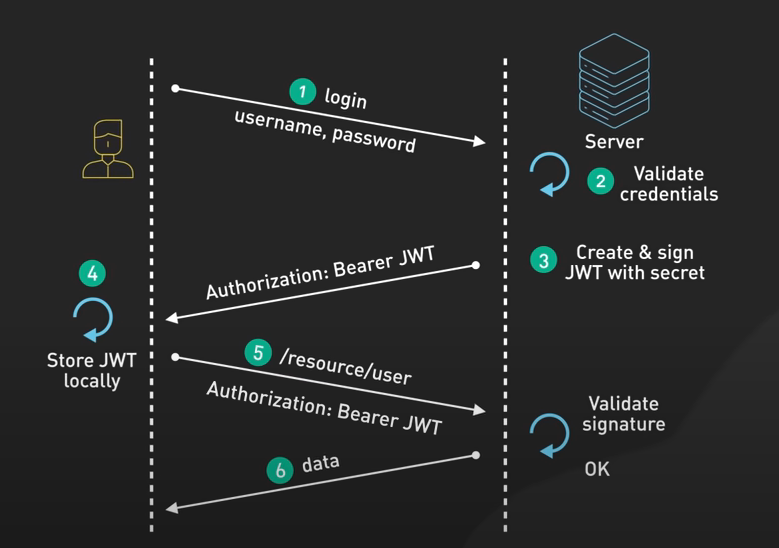

# JWT

JSON Web Tokens are a robust method for securely transmitting information between parties as JSON objects. They are used for web security for good reasons.

* JSON's lightweight, easy to read and write for humans and simple for machines to parse and generate.
* It's the backbone of JWTs because it represents its payload, which is where you store the data you want to transmit.
* JWT has three parts in the structure. Each section is base64 encoded and separate by a period.
  * Header: It typically consists of the token type, which is JWT and the algorithm being used, like HMAC SHA256 or RSA.
  * Payload: This is where you store the claims. Claims are statements about an entity, which is typically the user with some additional data. There are three types of claims: registered, public, and private.
    * Registered claims are predefined, like the issuer, expiration time, and subject.
  * Signature: Signing is like sealing an envelope with a wax stamp to ensure that it hasn't been tampered with. It can have:
    * Base64 header
    * Base64 payload
    * Secret
    * Cryptographic algo. This can be:
      * Symmetric algorithms, like HMAC SHA256 that use a shared secret key for both signing and verification. This is quicker and simpler, but may slightly less secure than asymmetric algo.
      * Asymmetric algorithms, like RSA, use a public / private key pair where private key signs a token and the public key verifies it.

While JWT payloads can be encrypted using JSON Web Encryption (JWE), most implementations use signed but not encrypted tokens. This means that which the data is encoded, it is not encrypted and can be read if intercepted. This is why sensitive information should never travel in a JWT payload unless it's encrypted first.

Signed JWTs provide authentication, authorization, and secure information exchange.

## Pros of JWT

* Self-contained
* Portable
* Don't require service-side storage

## How JWT works?

It is used in OpenID connect and OAuth2.

## When not to use JWT?

* For transferring sensitive info like Credit Card or Payment Info in payload
* Not ideal for managing user sessions, since these are stateless.
* Revoking JWT access can be challenging.
* It is vulnerable to token hijacking. It can provide full access to resources if intercepted.
* It can also be vulnerable to cryptographic weaknesses, especially when weak hashing algos are used. Automated brute-force hacks may compromise JWTs.

## Best practices while using JWT

* Keeping JWT payload compact by keeping ONLY the required claims. Large payload can lead to poor performance.
* Use short expiration time when possible.
* Use strong signature algo
* Remove or delete weak or possibly compromised tokens.
