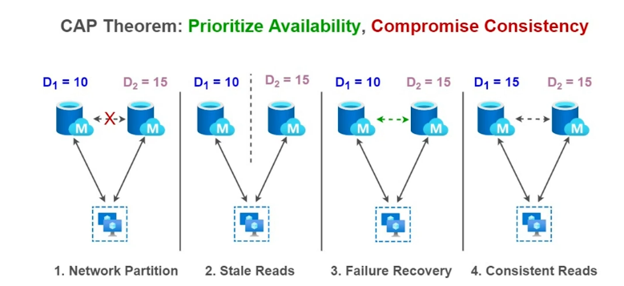
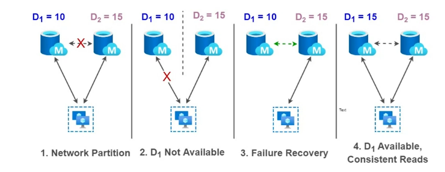

# CAP Theorem

Also known as Brewer's Theorem

Before we move to CAP theorem, let's understand three basis concepts of distributed system. 

## Network Partitioning and Partition Tolerance

Network partition: Network split due to the failure of network devices / communication links. Assume there are 4 nodes where node 1 and 2 are connected directly while node 3 and 4 are connected directly with each other. However, these are connected amongst themselves via a network switch. In case the switch fails, both of these node sets would be operating over a split network - this is called network partition.

A network can be disrupted due to nodes going down or failure of network links. This may lead to message being dropped or lost. Nodes in partition 1 will perceive nodes in partition 2 as failed and vice versa. Nodes within each partition can elect their own leaders and behave as two different distributed systems.

We want our system to be **partition tolerant** - this means that system should continue to function properly in spite of lost messages or any other problems.

Network failures in distributed system are unavoidable. We need to tolerate network partitions

## Availability
Availability characteristics of distributed system says that the system is always available in terms of read/write request for stored data. This means that every request is met with a non-error response. However, it does not guarantee the freshness or consistency of data.

## Consistency
For every read to data in distributed system, the most recent written (and consistent) value is returned. An error is returned if we cannot find one.

Now CAP theorem states that:

Any **distributed data store** can only provide two of the following three guarantees:
* Consistency: Every read receives the most recent write or an error.
* Availability: Every request receives a (non-error) response, without the guarantee that it contains the most recent write.
* Partition tolerance: The system continues to operate despite an arbitrary number of messages being dropped (or delayed) by the network between nodes.

When a network partition happens, it must be decided whether to
* cancel the operation and thus decrease the availability but ensure consistency. Example: Apache HBase, MongoDB, Redis, **or**
* proceed with the operation and thus provide availability but risk inconsistency. Example: Apache Cassandra, Riak, CouchDB
Thus, if there is a network partition, one has to choose between consistency and availability. Note that consistency as defined in the CAP theorem is quite different from the consistency guaranteed in ACID database transactions.

> Eric Brewer argues that the often-used "two out of three" concept can be somewhat misleading because system designers only need to sacrifice consistency or availability in the presence of partitions, but that in many systems partitions are rare.

> AP(Availability and Partition tolerance): When availability is chosen over consistency, the system is will always process the client request and try to return the most recent available version of the information even if it cannot guarantee it is up to date due to network partitioning.


> CP(Consistency and Partition tolerance): When consistency is chosen over availability, the system will return an error or time-out if particular information cannot be updated to other nodes due to network partition or failures.


Database systems designed with traditional ACID guarantees in mind such as RDBMS choose consistency over availability, whereas systems designed around the BASE philosophy (eventual consistency), common in the NoSQL movement for example, choose availability over consistency.

## Misconceptions related to CAP Theorem

### We always trade off between Availability and Consistency.
Fact: Both availability and consistency are feasible when no network partition occurs. Network partition happens very rarely.

### We always do without one of three guarantees
Fact: Partition tolerance is actually a given (and is managed within network topology). We only trade off between availability and consistency, when network partition occur.

## Extension of CAP Theorem (PACELC theorem)

The **PACELC theorem** builds on CAP by stating that in a distributed computer system even in the absence of partitioning, there is another trade-off between latency and consistency. 
```
IF network partitioning (P) THEN
  choose between availability (A) and consistency (C) (as per the CAP theorem)
ELSE (E)
  choose between latency (L) and consistency (C)
```

## WIP (Perhaps one of the best explanations of CAP)
https://martin.kleppmann.com/2015/05/11/please-stop-calling-databases-cp-or-ap.html

## FAQ

Source: [The CAP FAQ](https://www.the-paper-trail.org/page/cap-faq/)

### What is this document?

No subject appears to be more controversial to distributed systems engineers than the oft-quoted, oft-misunderstood CAP theorem. The purpose of this FAQ is to explain what is known about CAP, so as to help those new to the theorem get up to speed quickly, and to settle some common misconceptions or points of disagreement.

Of course, there’s every possibility I’ve made superficial or completely thorough mistakes here. Corrections and comments are welcome: let me have them. 

### Where did the CAP Theorem come from?

Dr. Eric Brewer gave a keynote speech at the Principles of Distributed Computing conference in 2000 called [Towards Robust Distributed Systems](https://people.eecs.berkeley.edu/~brewer/cs262b-2004/PODC-keynote.pdf). In it he posed his ‘CAP Theorem’ - at the time unproven - which illustrated the tensions between being correct and being always available in distributed systems.

Two years later, Seth Gilbert and Professor Nancy Lynch - researchers in distributed systems at MIT - formalised and proved the conjecture in their paper [Brewer’s conjecture and the feasibility of consistent, available, partition-tolerant web services](https://users.ece.cmu.edu/~adrian/731-sp04/readings/GL-cap.pdf).

### What does the CAP Theorem actually say?

The CAP Theorem (henceforth ‘CAP’) says that it is impossible to build an implementation of read-write storage in an asynchronous network that satisfies all the following three properties:
* Availability - will a request made to the data store always eventually complete?
* Consistency - will all executions of reads and writes seen by all nodes be atomic or linearizably consistent?
* Partition tolerance - the network is allowed to drop any messages.

The next few items define any unfamiliar terms.

More informally, the CAP theorem tells us that we can’t build a database that both responds to every request and returns the results that you would expect every time. It’s an impossibility result - it tells us that something we might want to do is actually provably out of reach. It’s important now because it is directly applicable to the many, many distributed systems which have been and are being built in the last few years, but it is not a death knell: it does not mean that we cannot build useful systems while working within these constraints.

The devil is in the details however. Before you start crying ‘yes, but what about…’, make sure you understand the following about exactly what the CAP theorem does and does not allow.

### What is ‘read-write storage’?

CAP specifically concerns itself with a theoretical construct called a register. A register is a data structure with two operations:
* ```set(X)``` sets the value of the register to X
* ```get()``` returns the last value set in the register

A key-value store can be modelled as a collection of registers. Even though registers appear very simple, they capture the essence of what many distributed systems want to do - write data and read it back. 

### What does atomic (or linearizable) mean?

Atomic, or linearizable, consistency is a guarantee about what values it’s ok to return when a client performs ```get()``` operations. The idea is that the register appears to all clients as though it ran on just one machine, and responded to operations in the order they arrive.

Consider an execution consisting the total set of operations performed by all clients, potentially concurrently. The results of those operations must, under atomic consistency, be equivalent to a single serial (in order, one after the other) execution of all operations.

This guarantee is very strong. It rules out, amongst other guarantees, _eventual consistency_, which allows a delay before a write becomes visible. So under EC, you might have:

set(10), set(5), get() = 10

But this execution is invalid under atomic consistency.

Atomic consistency also ensures that external communication about the value of a register is respected. That is, if I read X and tell you about it, you can go to the register and read X for yourself. It’s possible under slightly weaker guarantees (_serializability_ for example) for that not to be true. In the following we write A: to mean that client A executes the following operation.

B:set(5), A:set(10), A:get() = 10, B:get() = 10

This is an atomic history. But the following is not:

B:set(5), A:set(10), A:get() = 10, B:get() = 5

even though it is equivalent to the following serial history:

B:set(5), B:get() = 5, A:set(10), A:get() = 10

In the second example, if A tells B about the value of the register (10) after it does its ```get()```, B will falsely believe that some third-party has written 5 between ```A:get() ```and ```B:get()```. If external communication isn’t allowed, B cannot know about ```A:set```, and so sees a consistent view of the register state; it’s as if ```B:get()``` really did happen before ```A:set```.

[Wikipedia](https://en.wikipedia.org/wiki/Linearizability) has more information. Maurice Herlihy’s original paper from 1990 is available at [here](http://cs.brown.edu/~mph/HerlihyW90/p463-herlihy.pdf).

### What does **asynchronous** mean?

An asynchronous network is one in which there is no bound on how long messages may take to be delivered by the network or processed by a machine. The important consequence of this property is that there’s no way to distinguish between a machine that has failed, and one whose messages are getting delayed.

### What does **available** mean?

A data store is available if and only if all get and set requests eventually return a response that’s part of their specification. This does not permit error responses, since a system could be trivially available by always returning an error.

There is no requirement for a fixed time bound on the response, so the system can take as long as it likes to process a request. But the system must eventually respond.

Notice how this is both a strong and a weak requirement. It’s strong because 100% of the requests must return a response (there’s no ‘degree of availability’ here), but weak because the response can take an unbounded (but finite) amount of time.

### What is a partition?

A partition is when the network fails to deliver some messages to one or more nodes by losing them (not by delaying them - eventual delivery is not a partition).

The term is sometimes used to refer to a period during which no messages are delivered between two sets of nodes. This is a more restrictive failure model. We’ll call these kinds of partitions total partitions.

The proof of CAP relied on a total partition. In practice, these are arguably the most likely since all messages may flow through one component; if that fails then message loss is usually total between two nodes. 

### Why is CAP true?

The basic idea is that if a client writes to one side of a partition, any reads that go to the other side of that partition can’t possibly know about the most recent write. Now you’re faced with a choice: do you respond to the reads with potentially stale information, or do you wait (potentially forever) to hear from the other side of the partition and compromise availability?

This is a proof by construction - we demonstrate a single situation where a system cannot be consistent and available. One reason that CAP gets some press is that this constructed scenario is not completely unrealistic. It is not uncommon for a total partition to occur if networking equipment should fail. 

### When does a system have to give up C or A?

CAP only guarantees that there is some circumstance in which a system must give up either C or A. Let’s call that circumstance a _critical condition_. The theorem doesn’t say anything about how likely that critical condition is. Both C and A are strong guarantees: they hold only if 100% of operations meet their requirements. A single inconsistent read, or unavailable write, invalidates either C or A. But until that critical condition is met, a system can be happily consistent _and_ available and not contravene any known laws.

Since most distributed systems are long running, and may see millions of requests in their lifetime, CAP tells us to be cautious: there’s a good chance that you’ll realistically hit one of these critical conditions, and it’s prudent to understand how your system will fail to meet either C or A.

### Why do some people get annoyed when I characterise my system as CA?

Brewer’s keynote, the Gilbert paper, and many other treatments, places C, A and P on an equal footing as desirable properties of an implementation and effectively say ‘choose two!’. However, this is often considered to be a misleading presentation, since you cannot build - or choose! - ‘partition tolerance’: your system either might experience partitions or it won’t.

CAP is better understood as describing the tradeoffs you have to make when you are building a system that may suffer partitions. In practice, this is every distributed system: there is no 100% reliable network. So (at least in the distributed context) there is no realistic CA system. You will potentially suffer partitions, therefore you must at some point compromise C or A.

Therefore it’s arguably more instructive to rewrite the theorem as the following:

i.e. if your system may experience partitions, you can not always be C and A.

There are some systems that won’t experience partitions - single-site databases, for example. These systems aren’t generally relevant to the contexts in which CAP is most useful. If you describe your distributed database as ‘CA’, you are misunderstanding something.

### What about when messages don’t get lost?

A perhaps surprising result from the Gilbert paper is that no implementation of an atomic register in an asynchronous network can be available at all times, and consistent only when no messages are lost.

This result depends upon the asynchronous network property, the idea being that it is impossible to tell if a message has been dropped and therefore a node cannot wait indefinitely for a response while still maintaining availability, however if it responds too early it might be inconsistent.

### Is my network really asynchronous?

Arguably, yes. Different networks have vastly differing characteristics.

If
* Your nodes do not have clocks (unlikely) or they have clocks that may drift apart (more likely)
* System processes may arbitrarily delay delivery of a message (due to retries, or GC pauses)

then your network may be considered _asynchronous_.

Gilbert and Lynch also proved that in a _partially-synchronous_ system, where nodes have shared but not synchronised clocks and there is a bound on the processing time of every message, that it is still impossible to implement available atomic storage.

However, the result from #8 does not hold in the partially-synchronous model; it is possible to implement atomic storage that is available all the time, and consistent when all messages are delivered.

### What, if any, is the relationship between FLP and CAP?

The Fischer, Lynch and Patterson theorem (‘FLP’) (see [my blog post](https://www.the-paper-trail.org/post/2008-08-13-a-brief-tour-of-flp-impossibility/) for a link to the paper and a proof explanation) is an extraordinary impossibility result from nearly thirty years ago, which determined that the problem of consensus - having all nodes agree on a common value - is unsolvable in general in asynchronous networks where one node might fail.

The FLP result is not directly related to CAP, although they are similar in some respects. Both are impossibility results about problems that may not be solved in distributed systems. The devil is in the details. Here are some of the ways in which FLP is different from CAP:
* FLP permits the possibility of one ‘failed’ node which is totally partitioned from the network and does not have to respond to requests. 
* Otherwise, FLP does not allow message loss; the network is only asynchronous but not lossy. 
* FLP deals with consensus, which is a similar but different problem to _atomic storage_.

For a bit more on this topic, consult one of my [follow-on blog post](https://www.the-paper-trail.org/post/2012-03-25-flp-and-cap-arent-the-same-thing/).

### Are C and A ‘spectrums’?

It is possible to relax both consistency and availability guarantees from the strong requirements that CAP imposes and get useful systems. In fact, the whole point of CAP is that you _must_ do this, and any system you have designed and built relaxes one or both of these guarantees. The onus is on you to figure out when, and how, this occurs.

Real systems choose to relax availability - in the case of systems for whom consistency is of the utmost importance, like ZooKeeper. Other systems, like Amazon’s Dynamo, relax consistency in order to maintain high degrees of availability.

Once you weaken any of the assumptions made in the statement or proof of CAP, you have to start again when it comes to proving an impossibility result.

### Is a failed machine the same as a partitioned one?

No. A ‘failed’ machine is usually excused the burden of having to respond to client requests. CAP does not allow any machines to fail (in that sense it is a strong result, since it shows impossibility without having any machines fail).

It is possible to prove a similar result about the impossibility of atomic storage in an asynchronous network when there are up to N-1 failures. This result has ramifications about the tradeoff between how many nodes you write to (which is a performance concern) and how fault tolerant you are (which is a reliability concern).

### Is a slow machine the same as a partitioned one?

No: messages eventually get delivered to a slow machine, but they never get delivered to a totally partitioned one. However, slow machines play a significant role in making it very hard to distinguish between lost messages (or failed machines) and a slow machine. This difficulty is right at the heart of why CAP, FLP and other results are true.

### Have I ‘got around’ or ‘beaten’ the CAP theorem?

No. You might have designed a system that is not heavily affected by it. That’s good.

