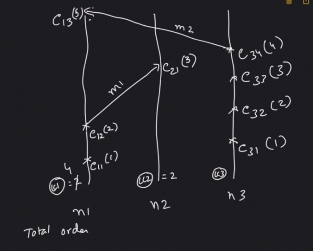
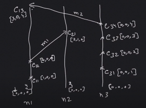

# Distributed Time

Notion of time is very fundamental to distributed system. We derive the idea of time from the order of occurring events. We say "An apple fell at 10:15 AM" if
* the occurred **after** our clock read 10:15 AM, and
* **before** our clock read 10:16 AM.

## Physical Time
Every system has a physical clock, and it can be drift away from the other systems. So, these physical time tries to keep itself sync with some global standards (GPS, etc.)

Operational definition of physical time is - what a clock reads.

Time is one of the seven fundamental physical quantities - ISI. SI base unit: the second. Time defines other quantities, like velocity, etc.

To describe observations of an event, define:
* A location (position in space)
* Time

Measuring time: clocks
* Clock: Physical mechanism, to count passage of time
* Clock Mechanism:
  * Gravity
  * Spring
  * Atomic Physics
* Timestamp: Time information about an event
* A sequence of events:
  * A series of items, actions, changes, or procedural steps, arranged in time order
  * Often have causality relationships among the items

### Time in a Distributed System
* Distributed System: Collection of distinct processes
  * Spatially separated
  * Communicate by exchanging messages
  * Each node would have its own physical clocks

* If two different events (A and B) occur on two such processes (P1 and P2) respectively:
  * Did "A" occur before "B"?
  * Did "B" occur before "A"?
  * Did A and B occur simultaneously?

If both the physical clocks are synchronized, then no problem. As both the processes are independent and communicate via message, for complete synchronization to happen, we need a very high network bandwidth (with no lag). This overhead is going to be huge and may not be required. So, the requirement to synchronize is dependent on what kind of system are we really building.

Generally we want to be build as low synchronization as possible per requirement.

## Logical Time

* In distributed system, each node is using its own physical clock. So, in that sense there is no notion of "Global Physical Time"
* When we say "A occurred before B":
  * Using physical time, system contains real clocks
  * Different clocks may show different time
  * No precise ordering of events
* The delays could also be because of network delays
  * Processing based on timestamp
    * Arrival timestamp is considered
    * Network delays play a part. If "A" occurred before B, but arrived at P3 later than B, then P3 records B as "earlier" occurrence
  * Effect of network delays varies:
    * Within a "compute" cluster
    * Across Data centre

To further understand issues in using physical clock, let's review **Clock Drift**.
* Most accurate time measurement: Atomic Clocks
  * Vibrations in atomic crystals
* A clock could have a speed different from a reference clock. Soon, their times **drifts apart**.
* Clock drift depends on:
  * The clock
  * The power source stability
  * subtle environmental variables
* The same clock would drift different, at different time.

The only way we can use physical clock is by synchronizing them - like is done for The Spanner Database implementation or White Rabbit and FSMTime. 
However, there is no easy way. This is why using physical clocks are not used in distributed system and is often solved using **Logical clocks**.

Use Logical clocks: Counters, etc
* Lamport Clocks (a clock that is updated only via messages sent inside the system, without using external sources, e.g. physical time)
* Vector Clocks

### Synchronization using Lamport clock (Linearize clock)

Each node is going use its own logical clock. It ticks only when an event of interest occurs. Initially logical clock would be set to 0. When the first event of interest occurs in node 1, say, e11 - we would increment the Logical clock counter to 1 and mark e11 to 1.
```
|-----------------*----------------*-------------------*------->
LCn1 = 0         e11(1)           e12(2)              e13(3)

|----------------------------*----------------------*----------->
LCn2 = 0                    e21(1)                 e22(2)

|----------------------------------*--------------------------->
LCn3 = 0                         e31(2)              

```

**Scenario 1: No sync required**

If the nodes have not exchanged any message with each other, nothing of common interest is happened across these nodes. In these case, we do not need to synchronize the clock at all.

**Scenario 2: If sender's clock is ahead of receiver's clock**
n1 send-event with LC1
n2 receive-event (): LC2

Receive-event must be timestamped more than send-event. In this case, update LC2 with time counters same as LC1 and then increment the counter.

**Scenario 3: If receiver's clock is ahead of sender's clock**
No action is required. Receiver should just timestamp the event.


The above is example of loose synchronization of time using logical clock in distributed system.



The node with the earlier number will get the priority (so would sender) to get the total order od events. In the example above, the order of event is: e11, e31, e12, e32, e21, e33, e34, e13

Tie-Break Rule: Nodes with lower number would be ordered before when timestamps are same.

Lamport's notion of linear time breaks if two events happened simultaneously, and we have to find if it did. We can solve this by using vector clock

### Synchronization using Vector clock



Increment its local counter. Incremental other node column only if the information is received. See the screenshot above.

Now the rule to create the event order is:

An event ```eij``` occurred before another event, ```elm``` if all the vector values of one event is greater than or equal to other event else we will call it occurring concurrently.

Wherever possible, using Lamport clock. Vector clock may be huge for large cluster and may not be really required unless we really want to debug any issue.

### Synchronization using Matrix clock
A matrix clock is a mechanism for capturing chronological and causal relationships in a distributed system.
Matrix clocks are a generalization of the notion of vector clocks.[1] A matrix clock maintains a vector of the vector clocks for each communicating host.

Every time a message is exchanged, the sending host sends not only what it knows about the global state of time, but also the state of time that it received from other hosts.

This allows establishing a lower bound on what other hosts know, and is useful in applications such as checkpointing and garbage collection.

