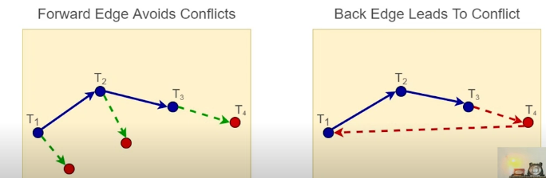
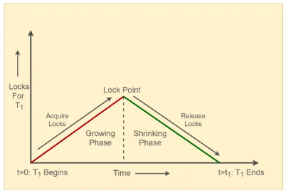
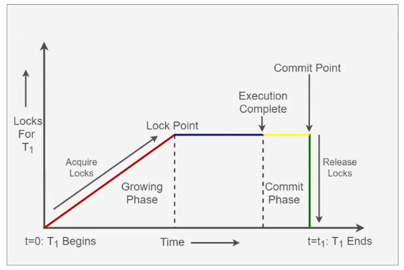

# Transaction Concurrency Control

The notion of time becomes extremely important while managing the consistency of a distributed system. It is only on the basis of time, we can determine the order in which events have happened and thus manage concurrency of the transactions.

## Common Data Access

Transaction satisfy ACID properties (Atomicity, Concurrency, Isolation and Durability)

* Processes access common data
  * Transactions - operations on data X:
    * Read X: R(X)
    * Write X: W(X)
    * Commit: C
* Online Railway Reservation System
  * Booking for Radhani Express (Bengaluru - New Delhi)
  * Travellers book from any location, any time
  * Same berth not allocated to two people

### Schedules & Conflicts

* Transaction: A sequence of operations on data items:
  * Example - T1 - R1(X)W1(X)C1
* Schedule: A sequence of operations of one or more transactions
  * T1 - R1(X)W1(X)C1
  * T2 - R2(X)W2(X)C1
  * Schedule: R1(X)R2(X)W1(X)W2(X)C1C2
* Serializability - If transactions are occurring concurrently, we should still be able to say that one transaction operation has been completely executed before other transaction begins execution. If the transactions meet this condition of serializability, then we can say that schedule of transaction is not conflicts else a conflict is detected.
* In our example of schedule above, A conflict occurred when:
  * T1 issues R(X), and T2 attempts W(X) concurrently
  * T1 issues W(X), and T2 attempts W(X) concurrently

### Resolving Conflicts
It is equivalent to serializing access to data
* Serial Schedule: If a schedule Sa consists of transactions, T1 and T2, and either:
  * T1 < T2 (T1 executes entirely before T2 begins), or
  * T2 < T1 (T2 executes entirely before T1 begins)
* Equivalent Schedules: Schedules Sa and Sb are equivalent, if
  * All operations Oi in Sa appear in Sb, and
  * All operations Oi in Sb appear in Sa
* We refer to Operations occurring as part of Transactions
* A schedule Sa is **conflict serializable** if it can be transformed
  * Into an equivalent serial schedule Sb
  * By swapping non-conflicting operations
  
```
Example

Data Items X, Y
T1: R1(X)W1(X) R1(Y)W1(Y)
T2: R2(X)W2(X) R2(Y)W2(Y)

Sa = R1(X)W1(X) R2(X)W2(X) R1(Y)W1(Y) R2(Y)W2(Y)
Sb = R1(X)W1(X) R1(Y)W1(Y) R2(X)W2(X) R2(Y)W2(Y)

By definition of Equivalent Schedules, we can see that both Sa and Sb are equivalent 
because all the operations of Sa is also present in Sb and vice-versa.

Hence, Sa, which has a conflict can be serialized to Sb which does not conflict since it is serial schedule.

Hence, we conclude that Sa is Conflict Serializable to Sb.
```
> If any schedule Sa can be reduced to a Serializable schedule Sb, then Sa is a valid schedule as far as consistency is concerned.

### Transaction Graph
Transaction Graph is another way to visualize transaction serializability.



As long as Transaction Graph is directed in a forward direction, the schedule would be serializable.

## Lamport time for concurrency control
It is useful to implement pessimistic concurrency. Clocks move very slowly figuring out events at each node - in that sense, the movement of clock is controlled all the time.

Each node would maintain request queues, where it would track the requests/messages it has received from other node. This request queue would be ordered in terms of time. As we have seen earlier, each request queue would have total order using Lamport time and is same as other node. 

When any node exchange requests for entering into a critical section, it must send a request for all the nodes (which has its node id and timestamp) and wait for acknowledgement from the nodes. This would ensure that any in progress events are settled and total order has been maintained. With a clear total order now the node can decide whether it should enter a critical section or not. If it enters a critical section and sends a release message, then other nodes can delete this request from request queue and decide which is the next request entering into a critical section.

The beauty of this algorithm is that all the nodes can work in a decentralized fashion - each node has request queue and make decision based on request queue. One overhead is that each node must gets its acknowledgement from all the other nodes before it can make any decision. This is why it is more suited for pessimistic concurrency control.
We may also need to assume that all channels are FIFO channels.

Decentralized but pessimistic.

## Mutual Exclusion for Database Concurrency Control
In Database, there are two kinds of locks - **Read Lock, RL(x)** which is shared lock and **Write Lock WL(x)** is an exclusive lock.
In mutual exclusion case, there is only lock, **Exclusive Lock**. 

What we are trying to do here is - understand how we can use Lamport time in implementing RL and WL for distributed concurrency control.  

Each node maintains Read and Write Transaction queue along with timestamp (using Lamport time). If a node needs data from some other node, it would send the queue along with its node it, so other node is now able to update its Lamport time. This way, as we have seen previously, total order of event is managed by the nodes and that way, consistency can be managed (pessimistic).

It gets little interesting when the above needs to be integrated with commit protocol when there is "write" involved, the data should not have visible to other transaction and must be kept on block until the commit is issued. Also, the writing transaction can have its pre-write copy to continue with its operation until commit is issued.


## Optimistic Timestamping protocol - NOT CLEAR
When most of the transactions do not conflict, this is the best approach. We allow the transactions to go on and at the very end, we validate if everything looks okay. If not, we will abort the transaction.

In this case, clocks are loosely synchronized so each clock keep going at its own pace. If you discover that a clock has moved and the system should not have done some operations, then you can come back (meaning the transactions are unwinded and point to previous consistent clock).

Assume each node has all the data local to themselves so each node can read and write from its local copy. The goal would be to keep them consistent. In this case, the node can broadcast its proposed read and write operations along with timestamp to all other nodes. Each node evaluates if these broadcasted operations are conflicting with their own operations and whether it can be resolved. Based on which, it sends its response back. If majority responds back with confirmation, the node can then send the final list of operations to all the other node to commit as well as it does.


## Pessimistic Concurrency Control
When most of the transactions are conflicting in nature, we allow the transactions to proceed only if they are going in the correct order. It does have some overhead of blocking transaction.

### Protocols
* Make sure incoming transactions
  * DO NOT conflict with existing ones
* We will discuss
  * 2-phase locking
  * 2-phase locking + commit protocol

### 2-Phase Locking
* Access to data item X controlled through Locks
  * Read Lock: RL(X) - Shared
  * Write Lock: WL(X) - Exclusive
* Write Lock is similar to Critical Section, which
  * Code that accesses a shared resource
  * Implements mutual exclusion
  * Executed by a transaction to access a data item

In a 2-phase locking, each transaction executing in 2 phases:
* Growing Phase: Acquire all needed locks
* Computation
* Shrinking Phase: Release all acquired locks



> If a transaction has released one lock, it can no longer ask for more lock. It means, if a transaction has moved to shrinking phase, it cannot go back to growing phase. This ensures that transactions are ordered. Any new transaction coming after this transaction has acquired its first lock (transaction has entered growing phases) would be ordered after this transaction. This inherently shows that backward movement of transaction graph would not be possible in 2-phase locking.

```
Example

Data Items X, Y
T1: R1(X)W1(X) R1(Y)W1(Y)
T2: R2(X)W2(X) R2(Y)W2(Y)

Sa = R1(X)W1(X) R2(X)W2(X) R1(Y)W1(Y) R2(Y)W2(Y)

T1: RL(X)WL(X) T2: Wait to acquire RL(X) and WL(X)
T1: RL(Y)WL(Y) T2: Wait to acquire RL(Y) and WL(Y)

Sa is serializable but 2-phase lock does not allow that and would not produce this schedule.

2-phase locking states:
T1: Executes, then release all locks
  T2: Executes, then releases all locks
Therefore, it would generate: Sb = R1(X)W1(X) R1(Y)W1(Y) R2(X)W2(X) R2(Y)W2(Y)
```

> Pessimistic concurrency runs with the risk of deadlock. Once transactions start acquiring lock and gets into waiting for resource in contention with another transaction which may now be waiting on this transaction to release lock. Other considerations like timeout, etc. may help resolve deadlocks.
> 2-phase locks always produces serializable schedules

#### Drawbacks
* Deadlocks (as explained above)
* Long-lived Transactions: Lock resources for longer
  * Affect throughput of short-term transactions

### Commit Protocol
Commit protocol is the point where the changes are permanently written to database. After shrinking phase (as transaction start to release lock, other transactions can acquire lock), transaction
  * Proceeds towards commit
  * Updated data is made available to other transactions
  * If Transaction issues Abort instead of Commit
    * Leads to Cascading Aborts (which might now have been acquired by other transaction)

This leads to a problem - we have relaxed the _isolation_ property of a transaction which means that partial effects of the transaction should not be visible to other transactions till it is committed. Therefore, we must integrate 2-phase lock with commit protocol and retain Locks until Commit happens. So, keep commit Phase after Shrinking Phase and release locks after commit phase.



This way, Commit Protocol preserves both Consistency and Isolation property of the transaction.

## Multiversion Concurrency Control (WIP)
Source: https://en.wikipedia.org/wiki/Multiversion_concurrency_control

Apache CouchDB uses MVCC. It is eventual consistency.


## 


## Further Case Studies
* [Distributed Locks with Redis](case-studies/distributed-lock-in-redis.md)
* [Distributed Locks in Zookeeper](case-studies/distributed-lock-in-zookeeper.md)
* [Main memory Database Concurrency](case-studies/main-memory-database-concurrency.md)


