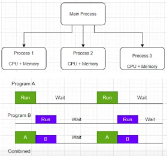
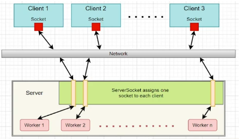
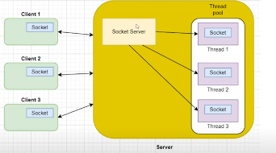

# Multi-threading with Thread Pools, and Multi-Processing

## Multi-threading with Thread Pools

### What is a thread?
* A thread is a sequential flow of control within a program
* It runs within the context of a program and takes advantage of the resources allocated for that program and the program's environment
* There can be many threads inside a process
* The thread has to be created first and prepared, by passing the function name to be called in the thread, and its arguments
* Start() function is required to start the thread
* When the control reaches Join() statement it indicates that the thread is complete. This is specifically required when thread can change the state of the program. Join() helps synchronize threads.

### Issues in Thread
* **Critical section**: is the program which tries to access shared resources. Only one process should be allowed to access the resource at a given point in time.
* **Deadlock**: when two processes are waiting for a resource which are held mutually by each other
* **Race condition**: A race condition occurs when two threads access a shared variable at the same time.

### Thread pool pattern (Python)
Most of the issues can be solved by using Thread pool pattern in Python.

* Thread pool is a set or cluster of threads that are initialized and are kept reading to undertake a group of tasks (which are in task queue).
* Provides high level interface for asynchronously running tasks, rather than working with individual threads
* Thread can be reused from the pool if a thread completes its execution.

#### Language features provided by Python
```concurrent.futures``` is a module used in Threadpool programming in Python. It consists of a subclass known as ```ThreadPoolExecuter``` which uses multi-threading. The ```ThreadPoolExecuter``` acquires a group of threads for assigning the tasks. ```ThreadPoolExecuter``` will allocate the tasks to the idle threads in the pool and schedules it. 

```
# start counter to check execution time of all the tasks in thread pool
start = time.perf_counter()
# Create a thread pool with required no. of threads
with concurrent.futures.ThreadPoolExecutor(4) as executor:
    futures = []
    # assign task for each thread (not in our control!)
    futures.append(executor.submit(number_of_words, (sentence)))
    futures.append(executor.submit(number_of_characters, (sentence)))
    futures.append(executor.submit(number_of_vowels, (sentence)))
    futures.append(executor.submit(number_of_odd_words, (sentence)))
    # wait until all the threads are complete
# end counter to check execution time of all the tasks in thread pool
finish = time.perf_counter()
# print time taken to execute the commands
print(f'\nFinished in {round(finish - start, 2)} second(s)')
```

It shows that we can run multiple tasks concurrently using Thread Pool.

#### Pros and Cons

| Pros                         | Cons                                                                                                                              |
|------------------------------|-----------------------------------------------------------------------------------------------------------------------------------|
| Better performance           | No control over the priority and state of the thread                                                                              |
| No need to recreate a thread | No stable identity can be given to the thread and hence no track can be kept                                                      |
| Saves time                   | When the thread pool is very busy allocating the tasks, it may happen that some process or task may be deleted                    |
| Easy to access               | The thread pool cannot work well when two threads are working simultaneously                                                      |
| Real-time usage              | There are situations where the application code can be affected by another application code, despite robust application isolation |


## Multi-Processing

* Multiprocessing is the ability to handle more than one process simultaneously.
* As soon as a job is scheduled, the OS interrupts and schedules another job from the pool. By doing this, new job starts its execution with its own CPU time.
* By following this method, the CPU time is not wasted by the system waiting for the Input/Output task to be completed.
* So, the final aim of multiprocessing programming is to keep the CPU busy by executing the waiting processes. 



### How is it different from Multi-threading?
In Multi-threading, the parent processing is the boundary while in multiprocessing, separate process is created out of the parent's boundary - with each separate process having its own CPU time and memory.

### Multiprocessing in Python
* **multiprocessing** is the package that supports in spawning new process in python
* In **multiprocessing**, processes communicate via messages. This module supports two types of communication
  * **Queue**: They are process and thread safe
  * **Pipe**: Return a part of connections objects by a pipe which is duplex
* It also supports sharing data among processes using **Array** and **Value** methods (via shared memory)
* Using **Pool** keyword, it is possible to maintain a pool of process and there are many ways to offload the worker process using the methods of **Pool**.

```
square_array = multiprocessing.Array('i', len(input_array))
square_sum = multiprocessing.Value('i')

# Spawning a process to calculate the square of each. no in the array
p1 = multiprocessing.Process(target=startProcess1, args=(input_array, square_array, square_sum))
p1.start()

cube_array = multiprocessing.Array('i', len(input_array))
cube_sum = multiprocessing.Value('i')

# Spawning a process to calculate the cube of each. no in the array
p2 = multiprocessing.Process(target=startProcess2, args=(input_array, cube_array, cube_sum))
p2.start()
time.sleep(2)
```

* Uses multiprocessing to create to process which are attached to a separate tkinter windows.
* The main server process creates an array of numbers and passes to these two client windows
* The client calculates the squares and cubes of these individual elements in its own process, displays it and returns the sum of the resultant array to the server.
* The server displays the sym of resultant arrays in the Text widget.

## Threadpool usage in Java Network Programming

* The client/server system has become a dominant one for the internet programming
* Much of the WWW is build on this client/server paradigm
* Clients are the web browsers run by many millions of individual users
* Similarly, there could be many server nodes that hosts these webserver which runs many sites on these webserver
* A single server at a single host can support many hundreds and thousands of clients.



* In Java, it is possible to build such client/server systems with sockets or with RMI (Remote Method Invocation)
* In a socket based client/server system, a server listens to a particular port for client applications sending requests for connections.
* A ServerSocket class is provided in Java that allows for a server to monitor and answer such requests for connections
* The client sends the request for a connection by creating a socket with the host name and port for that server



The webserver should do the following:
* Create a ServerSocket instance that watches for incoming client requests
* Create a Socket to connect with a client
* Spin off a thread from the Threadpool to handle the client's request
* Use Stream I/O to receive the clients requests and to send responses